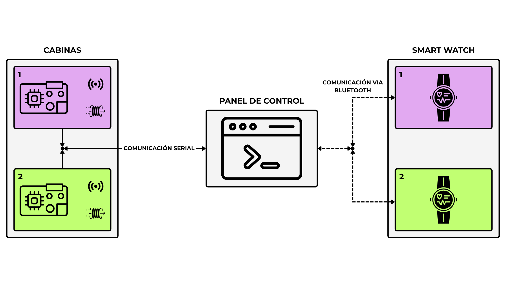
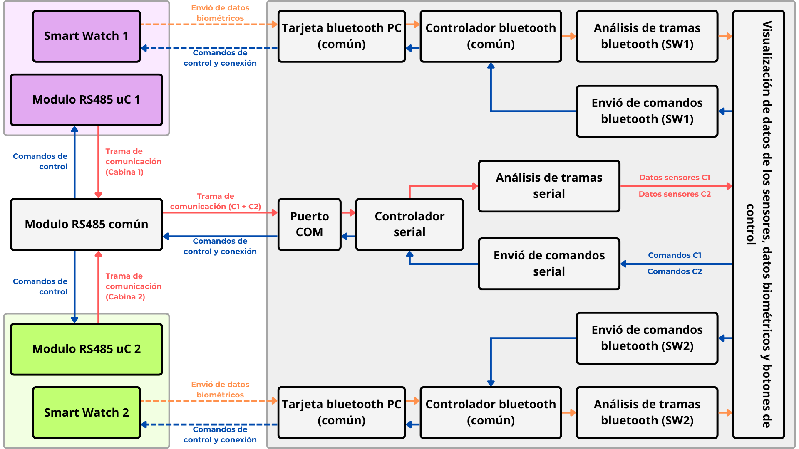

# ⚛️ CONTROL PANEL ⚛️


Interfaz centralizada (web/escritorio) para el control de actuadores y monitoreo de sensores biométricos en redes PAN. **Control Panel** gestiona la interacción entre módulos mediante protocolos seriales, permitiendo el intercambio ágil de comandos y datos de red.

---

## 🧱 Arquitectura general del sistema



## 🕸️ Arquitectura del sistema



---

## 📁 Organización carpetas

```plaintext
📁 BTN/
├── 🖥️ app/
|   ├── Escritorio/
|   |   └── HostApp/
|   ├── Backend/
|   |   └── ControlPanel.API/
|   └── Frontend/
├── 📃 docs/
├── 🖼️ imgs/
├── 🧪 test/
|   ├── Microcontroller/
|   ├── client/
|   ├── SmartWatchController/
|   ├── ControlPanel.API/
|   └── HostApp/
├── .gitignore/
├── LICENSE/
└── README.md/		<--- Este archivo
```

---

##  👨🏽‍💻 Copiar proyecto

```sh
git clone https://github.com/Jelp200/BTN.git
```
