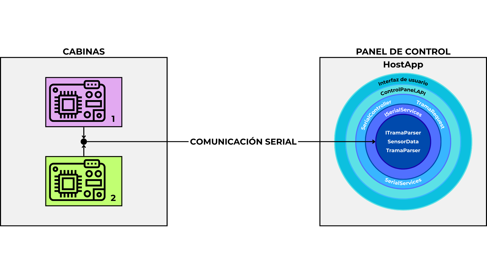

# PANEL DE CONTROL :control_knobs:


## 📋 Indice

1. [Descripción General](docs/DescripcionGeneral.md)
2. [Arquitectura del Sistema](docs/ArquitecturaDelSistema.md)
3. [Aplicación de Escritorio (C#)](docs/AplicacionEscritorio.md)
4. [Firmware del Microcontrolador (C)](docs/Firmware.md)
5. [Interfaz Web (Astro + Tailwind + JS)](docs/InterfazWeb.md)
6. [Comunicación entre Módulos](docs/ComunicacionEntreModulos.md)
7. [Autores y Licencia](docs/Autores.md)

---

## 📌 Descripción General

La aplicación desarrollada permite controlar actuadores y monitorear sensores conectados a un microcontrolador dentro de una cabina desde una interfaz de escritorio/web central. Los datos de los sensores y los comandos generados por la interfaz se intercambian mediante un protocolo serial entre los diferentes modulos.

> **_Nota._** Es posible controlar y visualizar datos de dos cabinas al mismo tiempo.

---

## 🧱 Arquitectura del Sistema



---

## :file_folder: Organizacion carpetas

```plaintext
BTN/
├── ControlPanel.API/
|   ├── ControlPanel.API/
|   └── ControlPanel.API.sln
├── HostApp/
|   ├── HostApp/
|   └── HostApp.sln
├── Microcontroller/
├── Test/
|   ├── output/
|   └── GenerarTramas.cpp
├── client/
|   ├── public/
|   └── src/
├── docs/
├── imgs/
├── .gitignore/
├── LICENSE/
└── README.md/
```

---

## :shipit: Copiar proyecto

```sh
git clone https://github.com/Jelp200/BTN.git
```
