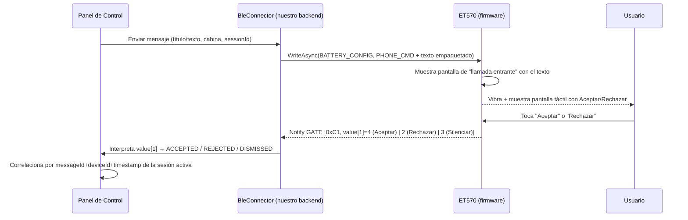
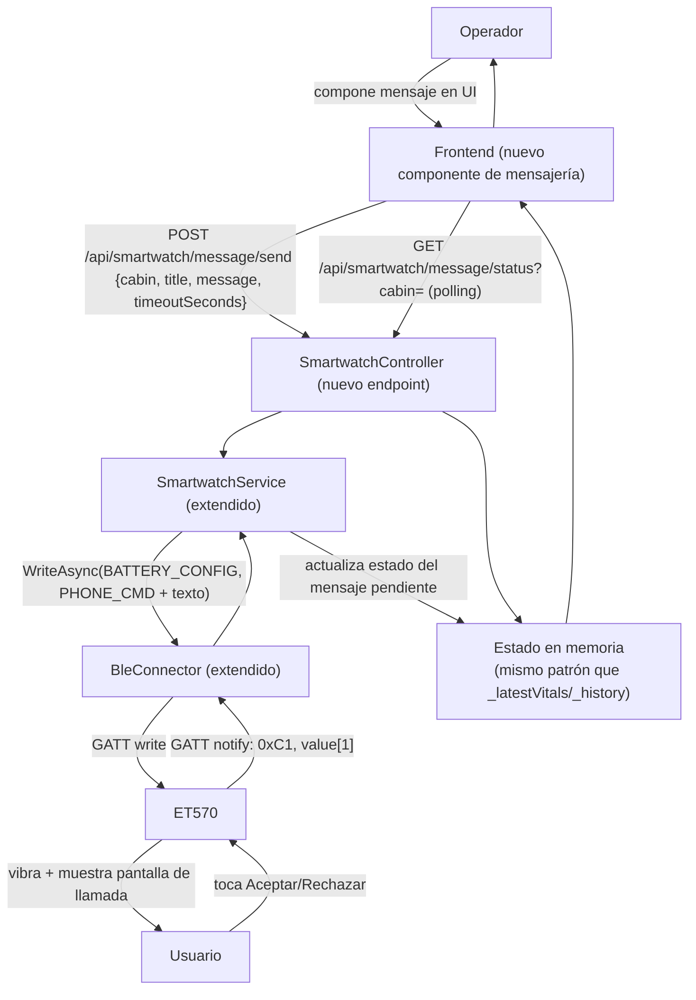

# SMARTWATCH_INTEGRATION_ANALYSIS.md

> Análisis de viabilidad: convertir el smartwatch/banda BLE **ET570** (protocolo H Band / Veepoo) en una terminal interactiva del Panel de Control.
> Generado mediante ingeniería inversa de la APK oficial decompilada (`source/Hband-decompiled/`, paquete `com.veepoo.hband`, versión 11.0.17) más verificación cruzada con fichas de producto públicas del modelo ET570.
>
> **MODO ANÁLISIS — no se modificó código, APK, manifiestos ni firmware. No se generó ninguna APK nueva.**
>
> Convención de evidencia: **[VERIFIED]** confirmado leyendo código/config directamente · **[INFERRED]** conclusión lógica a partir de evidencia parcial · **[UNKNOWN]** no determinable con lo disponible · **[HARDWARE_DEPENDENT]** depende de confirmar físicamente el hardware · **[SDK_DEPENDENT]** depende de capacidades del fabricante/chip.
>
> Regla aplicada estrictamente: que una API/permiso exista en la app **no** implica que el hardware la soporte, ni que la app la use activamente. Cada afirmación distingue "API disponible" de "la app la usa" de "el hardware lo soporta" de "acceso verificado".

---

## Pregunta principal

> ¿Podemos convertir estos smartwatches en terminales interactivas del panel de control capaces de recibir instrucciones, mostrar mensajes, confirmar recepción, obtener respuestas del usuario y enviar telemetría al panel?

**Respuesta corta: Sí, parcialmente, y con una estrategia específica ya identificada — no mediante un canal de notificación genérico, sino disfrazando los mensajes del panel como "llamadas entrantes" para aprovechar el único canal bidireccional que el firmware de la banda ya implementa.**

| | |
|---|---|
| **QUÉ YA EXISTE** | Comunicación BLE directa Panel↔Banda (ya implementada en `SmartwatchService.cs`/`BleConnector.cs`); un canal de push de texto unidireccional (`0xC2`); un canal de "llamada entrante" **bidireccional** con Aceptar/Rechazar/Silenciar real (`0xC1`); un comando de vibración (`0xAE`); confirmación de que el hardware ET570 tiene pantalla táctil HD y micrófono/altavoz físicos (ficha de producto). |
| **QUÉ PODEMOS REUTILIZAR** | El comando `0xC1` (`HEAD_PHONE_MESSAGE`) para lograr Aceptar/Rechazar real; el comando `0xC2` para mostrar texto simple sin necesidad de respuesta; el comando `0xAE` para vibrar/alertar; el patrón de correlación por cabina que ya existe (`SmartwatchServiceFactory.GetForCabin`). |
| **QUÉ DEBEMOS MODIFICAR** | `SmartwatchService.cs`/`BleConnector.cs`/`SmartwatchVitalsParser.cs` para agregar el envío de estos 3 comandos nuevos y el parseo de la respuesta `0xC1`; agregar una tabla de correlación `messageId↔cabina↔timestamp` en memoria (mismo patrón que ya usa `_latestVitals`/`_history`). |
| **QUÉ DEBEMOS CREAR** | Nuevos endpoints REST (`POST /api/smartwatch/message/send`, `GET /api/smartwatch/message/status`), un modelo de mensaje con estados, y UI en el frontend para componer/enviar el mensaje y ver la respuesta. |
| **QUÉ DEPENDE DEL HARDWARE** | Que el "hack de llamada falsa" (`0xC1`) funcione idénticamente en la ET570 física (los bytes están confirmados en el código genérico de la app "H Band", no se ha probado contra la unidad real); si el micrófono es accesible vía el mismo protocolo BLE documentado; comportamiento exacto de la pantalla al mostrar el texto de "llamada" (longitud visible, fuente, si soporta emoji). |
| **QUÉ NO ES POSIBLE** | Instalar código propio en la banda (no es programable, es un periférico BLE de firmware cerrado — no es Wear OS); usar gestos personalizados definidos por software (la detección de gestos vive en firmware cerrado); usar la pantalla para una UI 100% custom con botones arbitrarios más allá de las pantallas nativas del firmware (llamada, notificación, música, etc.); confirmar recepción/visualización ("DISPLAYED") de forma genérica y confiable para texto simple (`0xC2`) — solo el canal de llamada (`0xC1`) da una señal de interacción real. |

---

## 1. Executive Summary

La aplicación "H Band" (paquete `com.veepoo.hband`, v11.0.17) es una **app de teléfono compañera**, no una aplicación que corre en el reloj — el ET570 es un periférico BLE de firmware cerrado (fabricante Veepoo/chips Jieli-Goodix-Bluetrum) sin capacidad de ejecutar código de terceros. Toda "funcionalidad del reloj" está predefinida por su firmware y se activa/consulta exclusivamente mediante comandos BLE GATT con un byte de cabecera fijo — el mismo patrón que ya usa nuestro backend C# para BPM/SpO2/Temperatura/Presión Arterial.

El hallazgo más importante de este análisis es que existe un comando de "llamada entrante" (`HEAD_PHONE_MESSAGE`, byte `0xC1`) cuyo firmware **ya implementa un flujo de Aceptar/Rechazar/Silenciar con retorno BLE real** — es el único canal genuinamente bidireccional para interacción del usuario en todo el protocolo. El canal genérico de "notificación de texto" (`HEAD_SEND_CONTENT_TO_WATCH`, byte `0xC2`, el que usan WhatsApp/Telegram/etc.) es **solo de una vía**: no hay forma de saber si el usuario lo vio, lo descartó o interactuó con él.

**Conclusión operativa: para lograr un verdadero flujo "Panel envía mensaje → usuario Acepta/Rechaza → Panel se entera", se recomienda enviar el mensaje del panel disfrazado como una notificación de llamada entrante (`0xC1`), usando el campo de texto para el título/mensaje, y capturando el byte de respuesta (`2`=Rechazar, `3`=Silenciar/Descartar, `4`=Aceptar).** Esto es 100% viable con la arquitectura BLE directa que el backend ya tiene — no requiere nueva infraestructura (ni MQTT, ni servidor intermedio, ni teléfono compañero), solo extender el protocolo ya implementado en `SmartwatchService.cs`.

Adicionalmente se confirmó (ficha de producto pública del ET570, no del repositorio) que el dispositivo tiene **pantalla táctil HD de 1.96" (360x360)** y **micrófono/altavoz integrados** con función de "Bluetooth Call" como característica principal anunciada — esto de-riesga significativamente la recomendación anterior, ya que "contestar/rechazar llamada desde la muñeca" es precisamente el caso de uso central para el que este modelo fue diseñado.

---

## 2. Watch Architecture (arquitectura real de la app oficial)

```mermaid
flowchart TD
    subgraph Phone["Teléfono Android — com.veepoo.hband (H Band app)"]
        Launch["LaunchActivity → MainActivity"]
        BleSvc["BluetoothService (Foreground Service,\nforegroundServiceType=connectedDevice)"]
        NotifSvc["MessageNotifyCollectService\n(NotificationListenerService)"]
        NotifWatchdog["NotificationCollectorMonitorService\n(watchdog)"]
        Cloud["HttpUtil/HttpService → vphband.com\n(cuentas, analíticas, NO datos de sensores)"]
        AI["AIQAManager / WatchRecordingManager\n→ iFlytek SparkChain (ASR+LLM en la nube)"]
    end
    subgraph Band["ET570 (periférico BLE, firmware cerrado)"]
        GATT["Servicios/Características GATT\n(F008xxxx Battery, F003xxxx UI, 0000FEE7/FEA1)"]
        Screen["Pantalla táctil HD 1.96\" 360x360"]
        Mic["Micrófono + altavoz (Bluetooth Call)"]
        Sensors["Sensores biométricos (HR/SpO2/Temp/PA/ECG)"]
    end

    Launch --> BleSvc
    BleSvc <-->|"BluetoothGatt.connectGatt()"| GATT
    NotifSvc -->|"reenvía notificaciones del teléfono"| BleSvc
    NotifWatchdog -.mantiene vivo.-> NotifSvc
    BleSvc -.opcional.-> Cloud
    BleSvc <--> AI
    GATT --> Screen
    GATT <--> Mic
    GATT --> Sensors
```

**Componentes relevantes [VERIFIED, `source/Hband-decompiled/resources/AndroidManifest.xml` + lectura directa del código]:**

- **`activity.LaunchActivity`** → **`activity.MainActivity`** (`singleTask`): pantallas de la app, 223 Activities en total (la enorme mayoría UI de features no relacionadas con nuestro caso de uso: temas, mapas, deportes, redes sociales).
- **`ble.BluetoothService`**: servicio en primer plano (`foregroundServiceType="connectedDevice"`, permiso `FOREGROUND_SERVICE_CONNECTED_DEVICE`) que mantiene la única conexión GATT persistente (`BluetoothGatt mBluetoothGatt`) — es el equivalente funcional exacto de nuestro `BleConnector.cs`/`SmartwatchService.cs`.
- **`phone.MessageNotifyCollectService`** (`extends NotificationListenerService`): lee las notificaciones del sistema del teléfono (WhatsApp, llamadas, SMS, ~25 apps con allowlist) y las reenvía a la banda vía `BluetoothService`.
- **`ble.NotificationCollectorMonitorService`**: watchdog que mantiene vivo al anterior.
- **`activity.MusicOpraterService`**, **`ble.AlarmService`**, **`activity.connected.oad.DfuService`** (firmware OTA vía Nordic DFU): servicios secundarios sin relevancia directa para nuestro caso de uso.
- **Sin Activity/Service Wear OS alguno.** Confirmado por ausencia total de `com.google.android.gms.wearable.*`/`DataApi`/`MessageApi`/`NodeApi` y de `uses-feature android:name="android.hardware.type.watch"` en el manifiesto. `[VERIFIED]`

**Veredicto de arquitectura: PHONE COMPANION APP, no Wear OS.** `[VERIFIED]` La banda ET570 no ejecuta ninguna lógica descargable — todo su comportamiento (qué pantallas muestra, qué botones responde, cómo vibra) es fijo en su firmware de fábrica y se activa solo mediante los comandos BLE ya definidos por el fabricante.

---

## 3. Communication Architecture

| Protocolo | Archivo/clase | Dirección | Confirmado en la app | Relevante para nuestro panel |
|---|---|---|---|---|
| BLE GATT directo | `ble.BluetoothService`, `ble.BleProfile` | Bidireccional | ✅ Es el único canal real hacia la banda | ✅ Sí — ya es el mecanismo que usa nuestro backend |
| HTTP/HTTPS a `https://www.vphband.com:9001/api/` | `httputil.HttpUtil`, `httputil.HttpService` | Bidireccional | ✅ Cuentas de usuario, analíticas, firmware-version-check, integración WeChat/Strava/Google Fit | ❌ No — no transmite datos de sensores/BPM; sin relación con nuestro flujo |
| MQTT | — | — | ❌ No usado en ninguna parte de la app `[VERIFIED — ausencia]` | ❌ N/A |
| WebSocket | — | — | ❌ Solo clases internas de OkHttp sin uso propio `[VERIFIED — ausencia]` | ❌ N/A |
| Firebase Cloud Messaging | — | — | ❌ No integrado (solo 3 clases de excepción transitivas) `[VERIFIED — ausencia]` | ❌ N/A |
| Wear OS Data Layer | — | — | ❌ Cero referencias en todo el código `[VERIFIED — ausencia]` | ❌ N/A |
| Bluetooth Classic / SPP | `activity.binderbluetooth3`, `j_l.classic.*` | — | 🟡 Existe una ruta secundaria de Bluetooth clásico para chips Jieli más antiguos (`BluetoothDiscovery`, etc.) `[INFERRED — no se profundizó]` | 🟡 Posible ruta alterna para SKUs distintos al ET570, no confirmada como necesaria |

**Conclusión:** la única superficie de comunicación aplicable es **BLE GATT directo**, exactamente la que el backend C# ya implementa. No hay ningún backend en la nube, protocolo de mensajería o canal alterno que valga la pena adoptar para este caso de uso.

---

## 4. Notification Feasibility (Panel → Watch)

Comparación de las opciones planteadas:

| Opción | Viabilidad | Justificación |
|---|---|---|
| **A — Panel → BLE → Smartwatch** | 🟢 **Recomendada** | Ya es el patrón arquitectónico existente (`SmartwatchService.cs`/`BleConnector.cs`). Solo requiere agregar 2-3 comandos nuevos al protocolo ya implementado. Cero infraestructura nueva. |
| B — Panel → Wi-Fi → Smartwatch | 🔴 No viable | La ET570 no tiene interfaz Wi-Fi propia — toda su conectividad es BLE. `[VERIFIED — ausencia de Wi-Fi en el protocolo GATT y en la app]` |
| **C — Panel → Backend/API → Smartwatch** | 🟢 Ya es parcialmente cierto | En la práctica, esta opción y la A son la misma cosa en nuestra arquitectura: el "Backend/API" (`ControlPanel.API`) es quien habla BLE directo con la banda — no hay una capa API intermedia separada del componente BLE. Se recomienda seguir así (no separar en un microservicio adicional). |
| D — Panel → MQTT → Smartwatch | 🔴 No viable / innecesario | Requeriría un broker MQTT y que la banda hablara MQTT, lo cual no soporta (es un periférico BLE puro). Agregaría infraestructura sin beneficio. |
| E — Panel → Companion Phone → Smartwatch | 🟠 Técnicamente posible, no recomendada | Podría reutilizarse el propio APK "H Band" corriendo en un teléfono intermedio que reciba comandos de nuestro panel y los reenvíe. Añade una capa completa (Android + teléfono físico + la app original) para lograr lo mismo que ya hacemos con BLE directo — complejidad y punto de falla adicional sin beneficio claro. |
| F — Otra arquitectura encontrada | — | No se encontró ninguna arquitectura adicional relevante (sin MQTT, sin WebSocket, sin Data Layer). |

**Recomendación: Opción A (=C en la práctica). No agregar nueva infraestructura de comunicación.**

---

## 5. Acknowledgement Feasibility

| Estado | ¿Verificable técnicamente? | Cómo |
|---|---|---|
| `SENT` | ✅ Sí | El backend confirma que `WriteAsync()` a la característica GATT retornó éxito (`GattCommunicationStatus.Success`) — ya es el patrón usado hoy para todos los comandos existentes. |
| `DELIVERED` | ✅ Sí (a nivel transporte) | El propio `WriteValueAsync` de Windows BLE ya es un ACK de transporte GATT — si retorna éxito, el paquete llegó a la pila BLE del dispositivo. Esto **no** garantiza que el firmware lo haya procesado como una llamada válida, pero es el nivel de ACK de aplicación disponible sin más trabajo. |
| `DISPLAYED` | 🟠 Solo indirectamente, vía el canal de llamada | El protocolo no tiene un ACK explícito de "se mostró en pantalla" para texto genérico (`0xC2`). Para el canal de llamada (`0xC1`), la *ausencia* de una respuesta de "llamada rechazada automáticamente" (fuera de cobertura, apagado, etc. — no confirmado en este análisis) sugiere que se mostró, pero no es una confirmación positiva explícita. `[INFERRED]` |
| `ACCEPTED` / `REJECTED` | ✅ **Sí, viable** — vía canal `0xC1` | El firmware YA envía de vuelta `value[1]==4` (Aceptar) o `value[1]==2` (Rechazar) cuando el usuario interactúa con la pantalla de "llamada". Es una respuesta de aplicación real, no solo de transporte. |
| `TIMEOUT` | ✅ Sí, pero es lógica nuestra | No es algo que el dispositivo reporte — el panel debe implementar su propio temporizador desde que se envía el mensaje hasta que llega una respuesta `0xC1`, y marcar `TIMEOUT` si expira. |
| `FAILED` | ✅ Sí | Cualquier excepción en `WriteAsync`/`ConnectAsync` (dispositivo desconectado, error GATT) ya se captura hoy en el patrón existente. |

**Distinción crítica (pedida explícitamente por el usuario):** un `WriteAsync()` exitoso (ACK de transporte BLE) **no** equivale a que el usuario haya leído el mensaje. Solo el canal `0xC1` da una señal de **interacción real del usuario** (aceptar/rechazar), y solo para ese canal específico — no para el canal de texto genérico `0xC2`, que sigue siendo "disparar y rezar" (fire-and-forget) sin ninguna confirmación de lectura.

---

## 6. Accept / Reject — el hallazgo central

### Mecanismo real confirmado en el firmware

`source/Hband-decompiled/sources/com/veepoo/hband/ble/BleProfile.java` (verificado directamente con Grep):

```java
public static final byte HEAD_PHONE_MESSAGE = -63;               // 0xC1
public static final byte[] MSG_CMD   = {HEAD_PHONE_MESSAGE, 1, 1, 1};
public static final byte[] PHONE_CMD = {HEAD_PHONE_MESSAGE, 1, 6, 0};   // "llamada entrante"
public static final byte[] MSG_PHONE_CLOSE_CMD = {HEAD_PHONE_MESSAGE, 0, 0, 0};
```

`source/Hband-decompiled/sources/com/veepoo/hband/ble/BluetoothService.java:821-846` (verificado directamente, cita literal de la lógica):

```java
} else if (action.equals(BleProfile.PHONE_MESSAGE)) {
    if (value[1] == 2) {
        // ... "拒接来电操作" (acción: rechazar llamada)
        PhoneCallUtil.rejectCall(BluetoothService.this.mContext);
    } else if (value[1] == 3) {
        // "来电静音" (silenciar llamada)
        PhoneCallUtil.phoneSilence(BluetoothService.this.mContext);
    } else if (value[1] == 4) {
        // "来电接听" (contestar llamada)
        BluetoothService.this.answerRingingCall();
    }
}
```

Esto confirma **un flujo de dos vías real, implementado en el firmware de fábrica de la banda**, no algo que la app añade por software:



### Mecanismos de interacción soportados por el dispositivo

De la investigación del código y de la ficha de producto (pantalla táctil HD 1.96", sin corona ni botones físicos mencionados en las fuentes revisadas):

| Mecanismo | Soportado | Evidencia |
|---|---|---|
| Botones táctiles en pantalla | ✅ Sí | Pantalla táctil HD confirmada por ficha de producto; el flujo de llamada (aceptar/rechazar) ya la usa |
| Gestos (swipe, etc.) | 🟠 Posible pero no confirmado como configurable desde software | El firmware podría soportar swipe internamente (común en bandas de este tipo para descartar notificaciones), pero no hay gancho en la app para definir gestos custom |
| Botones físicos / corona | `[UNKNOWN]` | No hay evidencia en el código ni en las fichas de producto revisadas sobre botones físicos o corona giratoria en la ET570 |
| Notification actions (Android) | ❌ N/A | Concepto de Android/Wear OS — no aplica, la banda no ejecuta Android |
| Custom Activity / Dialogs / Tiles / Complications | ❌ No aplica | Son conceptos de Wear OS; la banda no es programable |

### Correlación de mensajes

Se recomienda un modelo simple, análogo al ya usado para vitales (`SmartwatchVitals`/`_history` en `SmartwatchService.cs`):

```json
// Panel → Backend
{
  "messageId": "uuid-v4",
  "cabinId": "C1",
  "sessionId": "SESSION-123",
  "title": "Confirmación requerida",
  "message": "¿Se encuentra preparado para iniciar la sesión?",
  "timeoutSeconds": 30
}
```
```json
// Backend → Panel (tras recibir la respuesta BLE)
{
  "messageId": "uuid-v4",
  "deviceId": "AA:BB:CC:DD:EE:FF",
  "cabinId": "C1",
  "response": "ACCEPTED",   // ACCEPTED | REJECTED | DISMISSED | TIMEOUT | FAILED
  "timestamp": "2026-09-04T20:00:01Z"
}
```

Dado que **solo un mensaje puede estar "en vuelo" a la vez por cabina** (el firmware de la banda no soporta colas de llamadas simultáneas), el backend debe mantener como máximo un `messageId` pendiente por instancia de `SmartwatchService` — exactamente el mismo patrón mutex/estado que ya usa para las mediciones de BPM/SpO2/etc. (`_bpmMonitoringActive`, etc.).

---

## 7. Gesture Support

🔴 **No viable con la arquitectura actual.**

- No existe detección de gestos (acelerómetro/giroscopio de muñeca) en el código de la app — toda esa lógica, si existe, vive dentro del firmware cerrado de la banda (ej. "raise-to-wake nocturno", `ble.readmanager.NightTurnWristHandler.java`, que solo expone un *toggle* on/off, no una API de gestos configurables). `[VERIFIED — ausencia de `SensorManager`/`TYPE_ACCELEROMETER`/`TYPE_GYROSCOPE` en el lado app; el gesto se detecta en firmware]`
- No hay forma de definir "Gesto A → ACCEPT, Gesto B → REJECT" desde software — el fabricante no expone esa API.
- Riesgos que aplicarían si se intentara igualmente (para referencia futura, no como plan de acción): falsos positivos altos en un contexto de cabina con vibración/movimiento del usuario, mala accesibilidad para usuarios con movilidad reducida, consumo de batería del sensor si se implementara vía firmware personalizado (no posible aquí).
- **Comparación gesto vs. botones en pantalla vs. botones físicos:** dado que la ET570 tiene pantalla táctil y ya implementa un flujo Aceptar/Rechazar nativo por esa vía (canal `0xC1`), los **botones en pantalla (ya existentes en el firmware) son la única opción real y también la más confiable** — no hay necesidad ni posibilidad de gestos custom.

---

## 8. Microphone Support

| Pregunta | Respuesta |
|---|---|
| 1. ¿La app tiene permiso de micrófono? | ✅ Sí, `RECORD_AUDIO` en el manifiesto `[VERIFIED]` |
| 2. ¿El hardware parece tener micrófono? | ✅ Sí — confirmado por ficha de producto pública de la ET570 ("micrófono integrado", función "Bluetooth Call") `[VERIFIED — fuente externa al repo]` |
| 3. ¿Existe código que lo utilice? | ✅ Sí, dos rutas: (A) grabación en la **banda** con streaming BLE de audio Opus/PCM al teléfono (`WatchRecordingManager`, activa); (B) grabación con el micrófono del **teléfono** (`AIRecordingUtil`/`MediaRecorder`, código presente pero **desactivado** — `isUsePhoneMCF=false`, sin listener conectado) `[VERIFIED]` |
| 4. ¿El SDK permite usarlo? | ✅ Sí, para la ruta A (banda), vía los comandos BLE `0xA0`(start)/`0xA1`(stop) y paquetes de datos con head `0xD0` |
| 5. ¿Se puede capturar audio? | 🟡 Sí, en teoría, reimplementando el mismo protocolo de streaming Opus que ya usa la app oficial — no está implementado en nuestro backend hoy |
| 6. ¿Puede hacerse speech-to-text? | 🟠 Solo en la nube (iFlytek SparkChain, fabricante chino) — no hay STT local en la app oficial; adoptar esto implicaría depender de un servicio de terceros (ver riesgos, sección 11) |
| 7. ¿Podemos enviar audio al panel? | 🟡 Técnicamente sí (una vez capturado el stream Opus/PCM vía BLE, se podría reenviar al frontend), pero requiere implementar el decodificador Opus y el protocolo de chunking — trabajo no trivial |
| 8. ¿Podemos enviar solo comandos de voz? | 🟠 Solo si se implementa algún tipo de reconocimiento de patrones (local o en la nube) — no hay comandos de voz predefinidos en el protocolo BLE en sí, solo audio crudo |
| 9. ¿Qué limitaciones existen? | El pipeline de audio de la app oficial depende de una SDK de IA en la nube de un tercero (iFlytek); implementarlo desde cero en C# implicaría reescribir el manejo de Opus, chunking BLE, y decidir un proveedor de STT propio |

**Veredicto: 🟠 Requiere investigación adicional.** El micrófono físico está confirmado por especificación de producto, y el protocolo BLE de streaming ya está parcialmente entendido (comandos `0xA0`/`0xA1`, datos `0xD0`), pero implementarlo es un esfuerzo considerablemente mayor que el flujo de texto/llamada — se recomienda dejarlo para una fase posterior (ver Roadmap, sección 14), y validar primero con la unidad física si el micrófono responde a estos comandos exactos.

---

## 9. Sensor Inventory

| Sensor | Detectado | Usado actualmente (backend C#) | Accesible | Potencial |
|---|---|---|---|---|
| Heart Rate (BPM) | ✅ Sí (BLE, head `0xD0`) | ✅ Sí | ✅ Sí | Ya explotado |
| SpO2 | ✅ Sí (BLE, head `0x80`/`0xD2`) | ✅ Sí | ✅ Sí | Ya explotado |
| Temperatura corporal | ✅ Sí (BLE, head `0x87`/`0x88`) | ✅ Sí | ✅ Sí | Ya explotado |
| Presión Arterial | ✅ Sí (BLE, head `0x90`) | ✅ Sí | ✅ Sí | Ya explotado |
| **ECG** | 🟡 Sí — **hallazgo nuevo, no documentado antes** (`ble.readmanager.EcgDevcieAuto.java`, `ManualMeasurementHandler.java`) | ❌ No | 🟠 Probablemente, formato de trama no decodificado en este análisis | Alto — variable biométrica adicional relevante para el caso de uso de cabinas de bienestar |
| Acelerómetro/Step counter | ✅ Sí (BLE, ya reportado por la banda) | ❌ No (no forma parte de nuestro protocolo actual) | 🟠 Probablemente, vía otro head byte no mapeado en nuestro parser | Medio — telemetría de actividad, no crítica para el caso de uso actual |
| Giroscopio | `[UNKNOWN]` | ❌ No | `[UNKNOWN]` | Bajo |
| GPS | ✅ Sí, pero del **teléfono**, no de la banda (`activity.gps.*`) | ❌ No aplica (nuestro sistema no usa teléfono intermedio) | ❌ No aplica | Ninguno para nuestro caso de uso |
| Luz ambiental | `[UNKNOWN]` | ❌ No | `[UNKNOWN]` | Bajo |
| Micrófono | ✅ Confirmado por ficha de producto | ❌ No | 🟠 Ver sección 8 | Alto pero costoso de implementar |
| Altavoz | ✅ Confirmado por ficha de producto (llamadas) | ❌ No | `[UNKNOWN]` si se puede activar de forma independiente a una "llamada" | Bajo-medio (podría usarse para tonos de alerta si el protocolo lo permite) |

---

## 10. Additional Opportunities

- **Vibración a demanda** — `HEAD_FIND_WATCH_BY_PHON (0xAE)`, comando `{0xAE, 1}`/`{0xAE, 0}` para abrir/cerrar el "buscar mi banda" — reutilizable directamente como "vibrar para alertar" sin necesidad de enviar ningún mensaje de texto. `[VERIFIED]`
- **Badge/ícono de tipo de app en el push de texto (`0xC2`)** — el protocolo ya soporta un byte de "tipo de app" para seleccionar el ícono mostrado; podríamos definir un ícono/tipo propio para mensajes del panel (sujeto a que el firmware acepte un valor no documentado — de otro modo, usar el código de "SMS" u "otro" genérico).
- **Precedente de botones bidireccionales adicionales** (no recomendados como mecanismo primario, mencionados como evidencia de que el hardware SÍ reporta eventos de botón):
  - Música (`HEAD_BATTERY_AUTO_CALLBACK`, `0x01`): play/pause/next/prev — el usuario ya puede "presionar botones" en la banda y el evento llega al teléfono.
  - Cámara (`HEAD_TAKE_PHOTO`, `0xB6`): disparo remoto de la cámara del teléfono desde un botón de la banda.
  - Estos confirman que el hardware/protocolo de esta familia de bandas SÍ soporta eventos de interacción bidireccionales — refuerza la confianza en que el canal de llamada (`0xC1`) es una capacidad real y no un caso aislado.
- **Timers/estado de sesión de cabina en pantalla:** no hay mecanismo confirmado para mostrar un timer persistente custom en la pantalla de la banda (esto requeriría un watchface o pantalla dedicada del firmware, no disponible) — se podría simular con notificaciones repetidas (`0xC2`), pero sería intrusivo y no es el uso previsto del canal.
- **SOS / Botón de emergencia:** no se encontró un comando dedicado de "SOS" en `BleProfile.java` durante este análisis (aunque el backend HTTP de la app sí tiene un endpoint `sos/device` — relacionado con una función de emergencia geolocalizada por GPS del teléfono, no aplicable a nuestro caso). Si se requiere un botón de emergencia iniciado por el usuario desde la banda, la ruta más viable sigue siendo interceptar el mismo canal `0xC1` (ej. "Rechazar" en un mensaje de tipo "confirmación de bienestar" podría interpretarse como señal de alerta en el panel) en lugar de esperar un comando de hardware dedicado que no se confirmó que exista.
- **Identificación de usuario (Watch↔User↔Cabin↔Session):** ya resuelto arquitectónicamente — `SmartwatchServiceFactory.GetForCabin(cabin)` asocia un reloj a una cabina, y la cabina ya se asocia a una sesión de operador en el frontend. No requiere cambios adicionales, solo extenderlo al nuevo flujo de mensajería.

---

## 11. Security Risks

| Severidad | Riesgo | Detalle |
|---|---|---|
| 🔴 Alta | Suplantación de mensajes/comandos | Cualquier proceso con acceso BLE al dispositivo (dado que la contraseña de autenticación H Band está hardcodeada en `"0000"`, ya señalado en `SYSTEM_ARCHITECTURE.md §23`) podría enviar una "llamada falsa" con contenido arbitrario, incluyendo `STOP`/`EMERGENCY`/instrucciones engañosas — el usuario no tiene forma de verificar que el mensaje viene realmente del panel legítimo. |
| 🟠 Media | Sin autenticación de origen del mensaje en el propio protocolo de aplicación | El canal `0xC1`/`0xC2` no lleva ninguna firma o token — es simplemente "quien tenga la conexión BLE activa puede escribir esto". La mitigación depende enteramente de la seguridad de la conexión BLE (que ya usa la contraseña de fábrica insegura). |
| 🟡 Media | Datos biométricos/de audio en tránsito sin cifrado adicional | BLE nativo sin capa de cifrado de aplicación — ya señalado como hallazgo en el análisis anterior del sistema (`ReporteDeAutenticacion.md`). Relevante especialmente si se implementa el streaming de audio (sección 8), que transmitiría voz del usuario en claro sobre BLE. |
| 🟡 Media | Necesidad de correlación segura de `messageId` | Si se implementa el flujo de mensajería, debe garantizarse que una respuesta `0xC1` recibida en la instancia de `SmartwatchService` de C1 no se atribuya jamás a un mensaje pendiente de C2 — mitigado naturalmente por el diseño actual (una instancia de servicio BLE por cabina, sin conexión cruzada), pero debe validarse explícitamente en la implementación (un solo mensaje pendiente a la vez por instancia, con expiración). |
| 🟢 Baja | Reutilización de un canal "de llamada" para un propósito distinto | No es un riesgo de seguridad per se, pero es un riesgo de **compatibilidad**: el firmware podría tener validaciones o comportamientos específicos de telefonía (ej. mostrar un ícono de teléfono, requerir que después llegue un "end call") que no se han probado exhaustivamente — se recomienda validar contra hardware real antes de depender de esto en producción. |

**Mecanismo de autenticación propuesto (a nivel de aplicación, no de BLE):** dado que no se puede modificar el firmware de la banda para agregar autenticación real, la mitigación debe vivir en el **backend/panel**: solo el propio `ControlPanel.API` debe tener la conexión BLE activa (ya es así hoy, es un proceso único), y se debe restringir/loguear quién en la red local puede invocar el nuevo endpoint de envío de mensajes (mismo problema de "API sin autenticación" ya señalado como crítico en `SYSTEM_ARCHITECTURE.md §23` — este nuevo endpoint hereda ese mismo riesgo si no se resuelve primero a nivel de API).

---

## 12. Recommended Architecture

**Arquitectura A — BLE directa, extendiendo el patrón existente.**



**Por qué esta arquitectura y no otra:** no introduce ningún componente nuevo de infraestructura (nada de MQTT, servidores intermedios, teléfonos compañeros) — es una extensión directa y mínima del mismo patrón `Controller → Service → BleConnector` que el proyecto ya usa consistentemente para BPM/SpO2/Temperatura/PA. Reutiliza exactamente el mismo modelo mental que un desarrollador que ya conoce `SmartwatchService.cs` puede entender sin aprender un paradigma nuevo.

`messageId`/`watchId`(=cabina)/`sessionId`/timeout/retry/ACK — ver contratos JSON de ejemplo en la sección 6.

---

## 13. MVP Recommendation

**P0 — MVP (necesario inmediatamente):**
- Enviar un mensaje de texto simple a la banda disfrazado de "llamada entrante" (comando `0xC1`/`PHONE_CMD`).
- Capturar la respuesta Aceptar/Rechazar/Silenciar (`value[1]` == 4/2/3).
- Vibración a demanda (`0xAE`) como alerta previa o independiente del mensaje.
- Estado online/offline del reloj (ya existe, vía el estado de conexión BLE actual).
- Correlación básica `messageId` + timeout configurado desde el panel.

**P1 — Segunda etapa:**
- Historial de mensajes enviados/respondidos por cabina (mismo patrón que `_history` de vitales).
- Reintentos automáticos ante fallo de escritura BLE.
- Badge/ícono diferenciado para mensajes del panel en el push de texto genérico (`0xC2`), si se confirma que el firmware lo soporta con un tipo de app no documentado.
- UI de composición de mensajes en el frontend (plantillas predefinidas de "Confirmación requerida", etc.).

**P2 — Avanzado (requiere validación de hardware/investigación adicional):**
- Streaming de audio desde el micrófono de la banda (protocolo Opus/BLE) — solo si se confirma la necesidad de negocio, dado el esfuerzo de implementación.
- Decodificación del protocolo ECG (`EcgDevcieAuto.java`) como nueva variable biométrica.
- Exploración de si el canal `0xC2` puede llevar algún tipo de "quick reply" no documentado en la versión de app analizada.

**P3 — Experimental:**
- Reconocimiento de voz/comandos vía IA en la nube (dependencia de terceros, mayor superficie de riesgo/privacidad) — solo si el negocio decide que vale la pena depender de un proveedor externo (iFlytek u otro) para esta función.
- Cualquier intento de aprovechar gestos — descartado salvo que aparezca evidencia nueva de que el fabricante expone una API para ello.

---

## 14. Future Roadmap

1. **Validación con hardware real** (bloqueante para P0): probar el comando `PHONE_CMD`/`0xC1` contra una ET570 física conectada directamente desde nuestro backend C# (igual que ya se hizo para BPM), confirmando que (a) la pantalla de "llamada" se muestra con nuestro texto, (b) el `value[1]` de respuesta llega con los mismos valores documentados.
2. Implementar el endpoint P0 y el estado de mensaje pendiente en `SmartwatchService.cs`.
3. UI mínima en el frontend para enviar un mensaje de prueba y ver la respuesta.
4. Evaluar necesidad real de negocio para P1/P2/P3 antes de invertir en ellos — especialmente el pipeline de audio, que es sustancialmente más costoso que el resto.

---

## 15. Unknowns / Missing Information

- Si el comando `PHONE_CMD`/`0xC1` funciona **idénticamente** en el firmware específico de la ET570 física que usa este proyecto — los bytes están confirmados en el código genérico de la app "H Band" (que soporta múltiples chips/SKUs: Jieli, Goodix, Bluetrum), no se ha probado contra la unidad real. **NOT FOUND IN REPOSITORY / requiere prueba física.**
- Formato exacto de la trama ECG (`EcgDevcieAuto.java`, `ManualMeasurementHandler.java`) — no se decodificó byte a byte en este análisis. **UNKNOWN.**
- Si existe algún límite de longitud de texto distinto para el campo de "identificador de llamada" (`0xC1`) respecto al ya documentado para notificaciones (`0xC2`, 14 bytes/paquete) — no se confirmó en el código leído. **UNKNOWN.**
- Si la pantalla de "llamada" muestra algún ícono de teléfono/UI que no se pueda ocultar o que resulte confuso para el operador/usuario de la cabina (impacto de UX de "disfrazar" un mensaje como llamada). **UNKNOWN — requiere prueba visual con hardware real.**
- Si el micrófono/altavoz confirmado por ficha de producto responde exactamente al protocolo `0xA0`/`0xA1`/`0xD0` documentado en la app genérica, o si la ET570 usa una variante distinta. **HARDWARE_DEPENDENT.**
- Existencia de un comando de "SOS" dedicado a nivel de firmware BLE (solo se encontró un endpoint HTTP `sos/device` orientado a geolocalización por teléfono, no aplicable). **UNKNOWN / NOT FOUND IN REPOSITORY.**
- Comportamiento del firmware si se recibe `PHONE_CMD` mientras ya hay un mensaje "en vuelo" (¿lo reemplaza? ¿lo ignora? ¿hace crash de la UI de la banda?). **UNKNOWN — requiere prueba física.**

---

## 16. Comparación de arquitecturas (detalle ampliado de la sección 4)

| Criterio | A — BLE directa | B — MQTT | C — API/Backend propio | D — Companion Device |
|---|---|---|---|---|
| Latencia | Baja (BLE directo, sin saltos) | Media (requiere broker) | Igual que A (es A en la práctica) | Alta (dos saltos BLE: panel↔teléfono↔banda) |
| Confiabilidad | Alta (ya probada para BPM/etc.) | Depende de infra adicional | Alta | Menor — depende de un teléfono físico siempre encendido y conectado |
| Complejidad | Baja — extiende código existente | Alta — requiere broker + banda no soporta MQTT nativamente | Baja (igual que A) | Alta — requiere mantener una app Android adicional |
| Escalabilidad (N cabinas/relojes) | Buena, mismo patrón `Factory.GetForCabin` generalizable | N/A (la banda no soporta MQTT) | Igual que A | Mala — un teléfono físico por cabina |
| Seguridad | Limitada por debilidades ya conocidas del protocolo BLE (contraseña fija) | N/A | Igual que A | Añade superficie de ataque (Android + apps de terceros instaladas) |
| Funcionamiento offline | Sí, mientras el PC y la banda estén en el mismo entorno BLE | No (requiere broker accesible) | Sí | Sí, pero depende de que el teléfono nunca se apague/desconecte |
| Consumo de batería (banda) | Igual en todas — determinado por el firmware de la banda, no por el transporte | Igual | Igual | Mayor uso de batería en el teléfono intermedio |
| Mantenimiento | Bajo — un solo lenguaje/proyecto (C#) | Medio-alto — nueva pieza de infraestructura | Bajo | Alto — mantener una segunda app Android además del panel |

**Recomendación final: Arquitectura A.** Ninguna alternativa aporta beneficio que justifique su complejidad adicional dado que la banda es, en esencia, un periférico BLE simple que ya hablamos directamente.

---

## 17. Casos de fallo

| # | Caso | Comportamiento recomendado |
|---|---|---|
| 1 | Reloj desconectado | El envío de mensaje falla inmediatamente con `FAILED` (no hay conexión GATT activa) — mismo patrón que ya usan `StartBpmMonitoringAsync` etc. al validar `_isConnected`. |
| 2 | La notificación no llega | Si `WriteAsync` no lanza excepción pero no se recibe respuesta `0xC1` dentro del `timeoutSeconds`, marcar `TIMEOUT`. |
| 3 | El reloj recibe el mensaje pero el usuario no responde | Igual que el caso 2 — se resuelve con el timeout configurado desde el panel, no hay señal explícita de "no leído" del dispositivo. |
| 4 | El usuario responde dos veces | El backend debe descartar cualquier respuesta `0xC1` posterior a la primera recibida para un `messageId` ya resuelto (idempotencia simple por estado "mensaje pendiente" limpiado tras la primera respuesta). |
| 5 | La respuesta llega tarde (después del timeout ya reportado al panel) | Se descarta — el mensaje ya fue marcado `TIMEOUT`; loguear el evento para diagnóstico, pero no reabrir el mensaje. |
| 6 | Se pierde conexión después de responder | No hay impacto — la respuesta ya se procesó antes de la desconexión; si se pierde conexión ANTES de que llegue la respuesta, tratar como el caso 1/2 (timeout/failed). |
| 7 | Watch 1 responde al mensaje de Watch 2 | No puede ocurrir por diseño actual: cada cabina tiene su propia instancia de `SmartwatchService`/`BleConnector` con su propia conexión GATT — una respuesta `0xC1` solo puede llegar por el evento de la conexión de esa instancia específica. Validar esto explícitamente en pruebas antes de asumirlo en producción. |
| 8 | El panel se reinicia | Se pierde el estado del mensaje pendiente en memoria (igual que hoy se pierden vitales/tramas al reiniciar `ControlPanel.API.exe` — deuda técnica ya documentada en `SYSTEM_ARCHITECTURE.md §18/24`). El mensaje pendiente en la banda seguiría mostrándose hasta que el usuario responda o el firmware lo descarte por su propia cuenta; el panel simplemente no podrá correlacionar esa respuesta tras el reinicio. |
| 9 | El reloj se reinicia | Se pierde cualquier mensaje pendiente en su pantalla; el backend eventualmente detecta la desconexión GATT y puede marcar el mensaje como `FAILED`. |
| 10 | La batería se agota | Mismo efecto que una desconexión — el backend debe detectar la pérdida de conexión GATT y marcar cualquier mensaje pendiente como `FAILED`/`TIMEOUT`. |
| 11 | El usuario rechaza | Se reporta `REJECTED` al panel de forma inmediata (no requiere timeout). |
| 12 | El usuario activa una emergencia | No hay un mecanismo de hardware dedicado confirmado (ver Unknowns) — si se define una convención de negocio (ej. "Rechazar" en un mensaje de tipo especial = alerta), debe documentarse explícitamente como una regla de la aplicación, no del protocolo del fabricante. |

---

## 18. Matriz de viabilidad

| Funcionalidad | Viabilidad | Complejidad | Riesgo | Dependencias |
|---|---|---|---|---|
| Enviar mensaje al reloj (texto simple, `0xC2`) | 🟢 Alta | Baja | Bajo | Ninguna nueva — extiende `SmartwatchService.cs` |
| Enviar mensaje al reloj (vía "llamada", `0xC1`) | 🟢 Alta | Baja-media | Medio (compatibilidad UX de "parecer una llamada") | Validación con hardware real |
| Confirmar recepción (SENT/DELIVERED) | 🟢 Alta | Baja | Bajo | Ninguna |
| Confirmar visualización (DISPLAYED) | 🔴 No viable de forma genérica | — | — | Solo inferible indirectamente vía el flujo de llamada |
| Accept/Reject | 🟢 Alta (vía canal de llamada) | Media | Medio | Validación con hardware real, mismo `0xC1` |
| Gestos | 🔴 No viable | — | — | Requeriría firmware propio (fuera de alcance) |
| Micrófono / captura de audio | 🟠 Requiere investigación adicional | Alta | Medio-alto (privacidad, dependencia de terceros) | Confirmación de protocolo con hardware real |
| Voz (comandos/STT) | 🔴 No viable localmente / 🟠 viable vía nube de terceros | Alta | Alto (privacidad, dependencia externa) | SDK de terceros (iFlytek u otro) |
| Vibración a demanda | 🟢 Alta | Baja | Bajo | Ninguna — comando `0xAE` ya identificado |
| Sensor biométrico adicional (ECG) | 🟡 Viable con modificaciones | Media | Bajo | Decodificar formato de trama (no hecho en este análisis) |
| Battery telemetry del reloj | 🟠 Requiere investigación adicional | Media | Bajo | No se confirmó en este análisis el comando exacto de lectura de batería (fuera del alcance de esta ronda) |
| SOS | 🟠 Requiere investigación adicional | Media | Medio | No se encontró comando de firmware dedicado; requeriría definir convención propia sobre `0xC1` |
| Multi-watch (N cabinas) | 🟢 Alta (con refactor ya identificado en la auditoría previa) | Baja-media | Bajo | Generalizar `SmartwatchServiceFactory` (ya documentado como deuda técnica en `SYSTEM_ARCHITECTURE.md §24`) |

---

## 19. Restricciones de reverse engineering

**Código propio de la app analizada:** `com.veepoo.hband.*` (paquetes `activity`, `ai`, `ble`, `config`, `font`, `handler`, `httputil`, `j_l`, `modle`, `permission`, `phone`, `sql`, `util`, `view`) — nombres de clase legibles, sin ofuscación estructural relevante para las áreas analizadas (manifiesto, BLE, notificaciones).

**SDKs de terceros identificados (no es código del fabricante de la app, son librerías incluidas):**
- **Jieli** (`com.jieli.jl_bt_ota`, `jl_rcsp`) — SDK del fabricante del chip BLE, usado para OTA/empaquetado de comandos.
- **Goodix** — SDK de un fabricante de chips biosensores, relevante al hardware de sensores de la banda.
- **Bluetrum** — otro SDK de chip BLE/OTA.
- **Nordic Semiconductor** (`no.nordicsemi.*`) — librería de DFU (actualización de firmware) y scanner BLE en background.
- **iFlytek** (`com.iflytek.sparkchain`) — SDK de reconocimiento de voz/IA en la nube (China).
- **MobTech** (`com.mob`, `cn.fly`) — SDK de identificación de dispositivo/SMS, parcialmente ofuscado.
- **Tencent Bugly**, **AutoNavi/AMap**, **Huawei HMS**, **Google Play Services/Fit**, **Strava** — SDKs de analítica/mapas/salud/social, sin relevancia para nuestro caso de uso.

**Código parcialmente ofuscado — `[UNKNOWN/OBFUSCATED]`:** subpaquetes internos de `cn.fly.commons` (`a`, `b`, `c`, `cc`) — SDK de identificación de dispositivo entregado pre-ofuscado por el proveedor; no se asumió ninguna función de sus clases internas.

**Código generado / no relevante:** `R.java` (recursos), clases de ProGuard/R8 no se detectaron como bloqueantes para las áreas analizadas.

---

## 20. Preguntas para el equipo

**Hardware**
- ¿Se puede probar el comando `PHONE_CMD`/`0xC1` directamente contra una unidad ET570 física antes de comprometerse con esta arquitectura para producción?
- ¿Existen unidades ET570 adicionales disponibles para pruebas destructivas/exploratorias (ej. enviar comandos no documentados sin riesgo para una unidad en uso activo)?

**Smartwatches**
- ¿Es aceptable, desde el punto de vista de experiencia de usuario, que un mensaje del panel se muestre como una "llamada entrante" en la pantalla de la banda? ¿O se requiere investigar más para encontrar una superficie de UI menos ambigua?
- ¿Qué prioridad de negocio tiene Accept/Reject real vs. simplemente mostrar mensajes sin confirmación (`0xC2`, más simple pero sin ACK de interacción)?

**Sensores**
- ¿Hay interés en decodificar el protocolo ECG (`EcgDevcieAuto.java`) como nueva variable biométrica del panel?

**Firmware**
- ¿El fabricante/proveedor de la ET570 tiene alguna documentación oficial del protocolo BLE (más allá de la ingeniería inversa de este análisis) que se pueda solicitar para reducir el riesgo de depender de comandos no documentados oficialmente?

**Comunicación**
- ¿Se acepta el riesgo de que el comando `0xC1` no esté disponible o se comporte diferente en una futura actualización de firmware de la banda (dado que no es un contrato oficial del fabricante hacia terceros)?

**Biométricos**
- ¿Es prioritario capturar audio/voz del usuario dentro de la cabina, dado el costo de implementación y las implicaciones de privacidad de depender de un SDK de IA en la nube de terceros?

**Backend**
- ¿Se aprueba resolver primero el problema de autenticación de la API (`SYSTEM_ARCHITECTURE.md §23`, ya señalado como crítico) antes de exponer un nuevo endpoint capaz de enviar "llamadas falsas" a dispositivos conectados?

**Seguridad**
- ¿Quién debe aprobar el uso de un canal de "llamada entrante" simulada para mensajería del panel, dado que técnicamente es un uso no documentado/no soportado oficialmente por el fabricante del protocolo?

---

## 21. RCSP Authentication (chip Jieli) — Estado de la ingeniería inversa (2026-09-04)

Trabajo adicional realizado tras el hallazgo inicial de que los comandos `0xC1`/`0xC2`/`0xAE` (capa "veepoo") no producían ningún efecto físico en la ET570 real. Se determinó que estos comandos requieren pasar primero por un candado de autenticación separado — el protocolo **RCSP** del chip Jieli (servicio BLE `0000AE00`, características `AE01`/`AE02`), independiente de la capa "veepoo" ya usada para biométricos.

### Qué se logró — algoritmo criptográfico 100% verificado

Se desensambló `libjl_auth.so` (ELF x86, extraído de la APK de "H Band") con Ghidra 12.1.3 (decompilación + emulación de p-code, incluyendo implementación de callbacks `CALLOTHER` para las instrucciones SSE2 `pshufb`/`psllw` que el emulador no soporta nativamente). Se reconstruyó y portó a C# (`Services/JlRcspAuth.cs`) el cifrado propietario completo:

- `ComputeSalt2` (mezcla SSE con dos tablas + `pshufb`)
- `KeySchedule` (schedule de 272 bytes: 16 de llave cruda + rotación izquierda de 3 bits por byte, combinada con una tabla de 256 constantes de ronda)
- `EncryptBlock` (cifrado de bloque de 8 rondas: blanqueo→S-box→blanqueo invertido→difusión tipo Pseudo-Hadamard, con dos S-boxes de 256 bytes)
- La orquestación completa (`EncryptResponse`)

**Cada una de estas piezas fue verificada byte-exacta** contra emulación directa del binario real (no solo contra la lógica decompilada) — incluyendo una emulación end-to-end completa de la función top-level (`FUN_00010820`) que reproduce exactamente el mismo resultado que el C# port, para múltiples vectores de prueba. Se corrigieron en el proceso dos errores de transcripción en la segunda tabla S-box y varios errores de orden/polaridad en el cifrado de bloque.

### La llave real NO es cero — hallazgo corregido

La hipótesis inicial (código Java de `RcspAuthManager.java` nunca llama a `setLinkKey()`, por lo que se asumió llave=0) era **incompleta**: la variable de 16 bytes que usa el cifrado (`DAT_00014030` en el binario) no vive en `.bss` (cero por defecto) sino en `.data`, con un valor **hardcodeado no-cero**. Investigación externa (Quarkslab, *"A modern tale of blinkenlights"*, blog.quarkslab.com/modern-tale-blinkenlights.html — análisis de un smartwatch Jieli AC6958C6 con el mismo mecanismo) confirmó que este chip usa la función legacy **E1 de Bluetooth** con:
- Llave hardcodeada de 16 bytes: `06 77 5F 87 91 8D D4 23 00 5D F1 D8 CF 0C 14 2B`
- "Identidad"/BD_ADDR hardcodeada de 6 bytes: `11:22:33:33:22:11`

Se confirmó **ambos valores existen byte-exactos en `libjl_auth.so`** (búsqueda directa en la memoria cargada del binario vía Ghidra: la llave en `0x14030`, la dirección en `0x14040` — exactamente donde el trazado de registros ya apuntaba). Se actualizó `JlRcspAuth.cs` para usar esta llave real en lugar de cero, y se re-verificó el pipeline completo contra una nueva emulación end-to-end con esta llave — **MATCH perfecto**.

### Por qué sigue fallando contra el reloj físico

A pesar de tener el algoritmo y la llave "de fábrica del SDK" perfectamente verificados contra el binario, **la prueba en vivo contra la ET570 real sigue fallando** (`POST /api/smartwatch/rcsp-auth-test` → `Failed`, con una respuesta del reloj completamente distinta a la calculada). Esto indica que:
- La llave `06 77 5F 87...` es el valor **de demostración del SDK de Jieli**, no necesariamente el que trae grabado de fábrica *esta unidad ET570 específica*. Es precisamente el hallazgo de seguridad que documentó Quarkslab: muchos fabricantes despliegan el SDK sin rotar esta llave demo, pero evidentemente el proveedor de esta unidad sí lo hizo (o usa una variante de firmware distinta).
- No hay forma de descubrir la llave real por más ingeniería inversa estática del `.so` — se agotó esa vía. El único camino que queda es una **captura de tráfico BLE real** entre la app oficial "H Band" y este mismo reloj físico, para observar un challenge/response auténtico.

### Intento de captura BLE — bloqueado por restricciones del teléfono disponible

Se intentó capturar el handshake con un teléfono Honor X8b (Android 14, build de producción/retail, sin root) vía `adb`, con los siguientes resultados:
- **Log HCI snoop de Bluetooth**: el toggle de "Habilitar registro HCI de Bluetooth" en Opciones de desarrollador no tuvo ningún efecto verificable (`persist.bluetooth.btsnooplogmode` permaneció vacío tras activarlo/reiniciar Bluetooth; `adb bugreport` no incluyó `/data/misc/bluetooth/logs/` en absoluto).
- **Logcat de la app**: los logs propios de `RcspAuth.java`/`RcspAuthManager.java` (que sí imprimen los bytes crudos del handshake) no llegan a `logcat` — la app no es depurable (`run-as` rechazado) y aparentemente sus logs de depuración están deshabilitados/filtrados en este build de producción.
- **`adb backup`**: devuelve un archivo esencialmente vacío — Android 12+ deprecó este mecanismo para apps normales.

**Conclusión: estas restricciones son del teléfono/ROM disponible (Honor MagicOS, sin root), no del método.** Las vías que quedan abiertas para una futura sesión, en orden de preferencia:
1. Un dongle sniffer BLE dedicado (ej. nRF52840 + plugin "nRF Sniffer for Bluetooth LE" de Wireshark) — captura pasiva por aire, sin tocar el teléfono. Requiere adquirir el hardware (~$10-15).
2. Rootear el teléfono de prueba (invasivo, riesgo de garantía/datos) para leer `btsnoop_hci.log` directamente.
3. Conseguir un Android más antiguo (≤9) o ya rooteado, donde el log HCI se expone directamente en `/sdcard` sin necesitar `bugreport`.

### Estado de los artefactos de este trabajo

- `Services/JlRcspAuth.cs` — algoritmo completo y verificado, ya usando la llave real (`06 77 5F 87 91 8D D4 23 00 5D F1 D8 CF 0C 14 2B`). Pendiente: reemplazar por la llave real de fábrica de la ET570 una vez obtenida por captura BLE.
- Herramientas de análisis (fuera del repositorio, en `C:\tools\`): proyecto Ghidra (`ghidra_project\jl_auth_analysis`), scripts de emulación (`ghidra_scripts\Emulate*.java`, `SearchBytes.java`), proyectos de prueba standalone en C# (`csharptest\`, `csharptest2\`) usados para verificar cada función del cifrado de forma aislada contra ground truth de Ghidra.
- `C:\tools\platform-tools\` (adb) y `C:\tools\ble_capture\` — herramientas y artefactos parciales del intento de captura BLE (bugreport, logcat, backup — todos sin el dato buscado), listos para reutilizar en una futura sesión con mejor hardware/teléfono.
