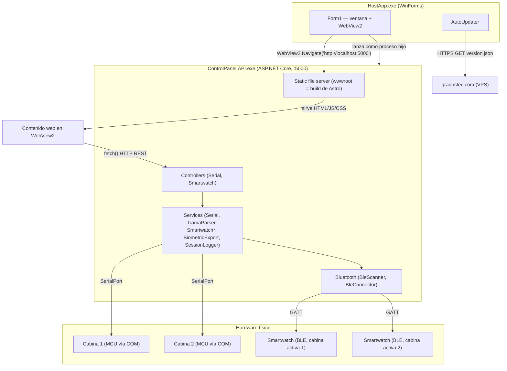
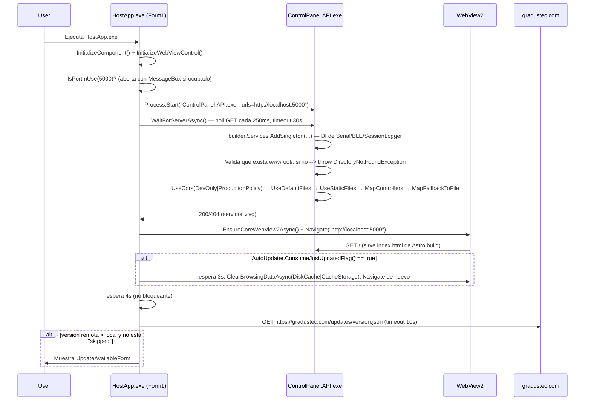
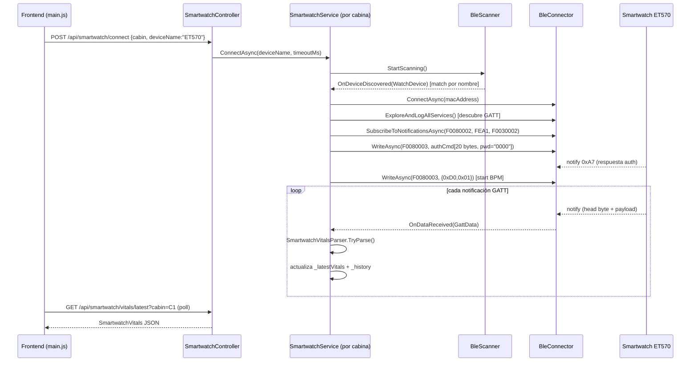
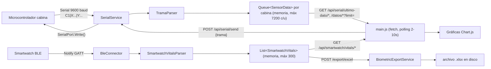
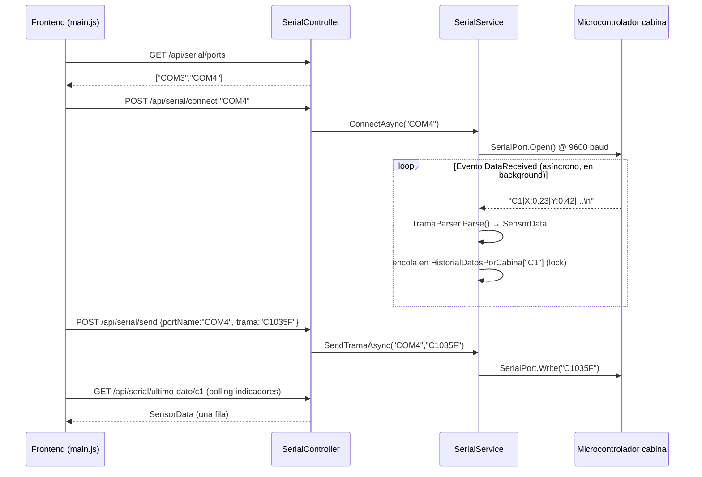

# SYSTEM_ARCHITECTURE.md — Control Panel (GITSE / BTN)

> Documento de arquitectura técnica generado mediante auditoría exhaustiva del repositorio (2026-09-04).
> Convención de evidencia usada en todo el documento:
> **[VERIFIED]** = confirmado leyendo código/config directamente · **[INFERRED]** = conclusión lógica a partir de varias piezas de evidencia · **[UNKNOWN]** = no determinable con el repositorio disponible.
>
> Este documento reemplaza cualquier entendimiento previo basado en el README (que describe una estructura de carpetas y una arquitectura de hardware **aspiracional**, no la implementada — ver sección 24).

---

## 1. Project Overview

Control Panel es una aplicación de escritorio para Windows que centraliza el **control de actuadores** y el **monitoreo de sensores** de dos cabinas ergonómicas de pruebas (Cabina 1 / Cabina 2), usadas por UPCH (Lima, Perú) y un cliente en Baja California, México. Adicionalmente integra relojes inteligentes (smartwatches BLE, modelo "ET570", protocolo propietario **H Band/Veepoo**) para capturar biométricos del usuario dentro de la cabina (BPM, SpO2, temperatura corporal, presión arterial).

- Cada cabina se controla enviando **comandos de 6-7 caracteres** por puerto serie (`C1035F`, `C2100F`, etc.) a un microcontrolador (ESP32/Arduino Mega, según el hardware real desconocido — ver Unknowns).
- Cada cabina reporta telemetría de sensores (acelerómetro XYZ, temperatura, humedad, UV, CO2, O3, decibeles) en tramas de texto `C1|X:0.23|Y:0.42|...`.
- Los datos biométricos se obtienen conectando un smartwatch por BLE a cada cabina de forma independiente.

**[VERIFIED]** `README.md:5`.

---

## 2. Technology Stack

| Capa | Tecnología | Evidencia |
|---|---|---|
| Shell de escritorio | WinForms + WebView2 (.NET 10, `net10.0-windows`) | `app/Escritorio/HostApp/HostApp/HostApp.csproj:5,7` |
| Backend / API | ASP.NET Core Web API (.NET 10, `net10.0-windows10.0.22621.0`) | `app/Backend/ControlPanel.API/ControlPanel.API/ControlPanel.API.csproj:4` |
| Frontend | Astro 5 + Tailwind CSS 4 + Chart.js 4 + chartjs-plugin-zoom + xlsx-js-style | `app/Frontend/package.json` |
| Comunicación con cabinas | `System.IO.Ports.SerialPort` (paquete `System.IO.Ports 10.0.2`) | `ControlPanel.API.csproj:10` |
| Comunicación con smartwatches | BLE nativo de Windows (`Windows.Devices.Bluetooth.*`, WinRT) | `Bluetooth/BleScanner.cs`, `Bluetooth/BleConnector.cs` |
| Exportación a Excel (backend) | ClosedXML 0.99.0 | `ControlPanel.API.csproj:11` |
| Exportación a Excel (frontend) | xlsx-js-style | `app/Frontend/package.json:17` |
| Empaquetado/instalador | Inno Setup (`.iss`) → instalador `.exe` autocontenido | `installer/CreateInstaller.iss` |
| Orquestación de build local | npm scripts raíz (`concurrently`) | `package.json` |

No hay base de datos relacional, ORM, ni motor SQL en ningún proyecto **[VERIFIED — ausencia de paquetes EF/Dapper/SQLite en ambos .csproj]**. Toda la persistencia de datos en tiempo de ejecución es en memoria (ver sección 18).

---

## 3. Repository Structure

```text
BTN/
├── app/
│   ├── Escritorio/HostApp/HostApp/       ← Shell WinForms + WebView2 (.exe host)
│   │   ├── Program.cs, Form1.cs           ← entry point, WebView2, lanzamiento de la API
│   │   └── AutoUpdater.cs, UpdateAvailableForm.cs, DownloadingForm.cs  ← auto-actualización
│   ├── Backend/ControlPanel.API/ControlPanel.API/  ← API REST ASP.NET Core (.exe standalone)
│   │   ├── Program.cs                     ← composición DI, CORS, hosting de wwwroot
│   │   ├── Controllers/  (SerialController, SmartwatchController)
│   │   ├── Services/     (SerialService, TramaParser, SmartwatchService,
│   │   │                  SmartwatchServiceFactory, SmartwatchVitalsParser,
│   │   │                  BiometricExportService, SessionLogger)
│   │   ├── Bluetooth/    (BleScanner, BleConnector)
│   │   ├── Interfaces/, Models/, DTOs/, Helpers/(FileLogger)
│   │   └── wwwroot/                       ← build de Astro copiado aquí (servido como SPA)
│   └── Frontend/                          ← proyecto Astro (fuente del wwwroot)
│       ├── src/pages/index.astro, src/components/**  ← UI (paneles, biometría, controles, gráficas)
│       └── public/scripts/*.js            ← TODA la lógica cliente (fetch a la API, estado, export)
├── docs/                                  ← documentación existente (ver sección 26/28)
├── installer/                             ← Inno Setup + scripts de build/deploy/auto-update VPS
├── test/
│   ├── Microcontroller/*.ino              ← sketches simuladores (NO firmware real)
│   ├── BotoneraSerial/                    ← fuente eliminada (solo quedan artefactos de build); era un
│   │                                         probador manual de comandos serie (ver sección 9)
│   └── cases/TestingCases_1.xlsx
├── source/
│   ├── H_Band/src_Ayma/ + Hband-decompiled/  ← código Java decompilado del APK oficial H Band (Veepoo),
│   │                                            usado como referencia de ingeniería inversa del protocolo BLE
│   └── LogsPerrones/*.txt                 ← logs de sesiones BLE reales capturadas (SessionLogger)
├── imgs/AGS.png, imgs/AS.png              ← diagramas de arquitectura (diseño intencionado, ver sección 24)
├── package.json                           ← orquestador raíz (scripts npm: dev/build/prod de todo el stack)
└── README.md
```

**Nota de divergencia [VERIFIED]:** `README.md:31-36` documenta una estructura `test/{client, SmartWatchController, ControlPanel.API, HostApp}` que **no existe** en el repositorio actual. El README está desactualizado respecto al estado real del código.

No existe un `.sln` en la raíz del repositorio **[VERIFIED]** — cada proyecto (`ControlPanel.API`, `HostApp`) se compila de forma independiente vía `dotnet build`/`dotnet publish` (ver `installer/build-installer.ps1`).

---

## 4. System Architecture

**Arquitectura real [VERIFIED]:** Es un sistema de **3 procesos independientes** coordinados por el shell WinForms, comunicándose por **HTTP REST puro sobre localhost** (no hay bridge nativo WebView2↔JS):



**Clasificación:** Arquitectura **híbrida cliente-servidor local + capas** (no es Clean Architecture ni MVVM). El backend sigue una separación pragmática **Controller → Service → Interface → Model** (inyección de dependencias vía `builder.Services.AddSingleton<...>` en `Program.cs:29-36`), sin capa de dominio/aplicación separada explícita. El frontend es una **SPA estática servida por el mismo backend** (no SSR en producción) con toda la lógica de estado en JS plano (sin framework de UI reactivo).

**Responsabilidades:**
1. **HostApp** — únicamente shell/lanzador: crea el proceso `ControlPanel.API.exe`, aloja WebView2, gestiona auto-actualización. No contiene lógica de negocio.
2. **ControlPanel.API** — toda la lógica de negocio: comunicación serial, comunicación BLE, parsing de protocolos, exportación de datos, logging.
3. **Frontend (Astro/JS)** — toda la UI y el estado de sesión del operador; consume la API vía `fetch()`.

**Acoplamiento fuerte [VERIFIED]:**
- `SmartwatchController` instancia directamente `new BiometricExportService()` en su constructor (`SmartwatchController.cs:32`) en lugar de inyectarlo — rompe el patrón DI usado en el resto del proyecto.
- `SmartwatchServiceFactory` crea sus propias instancias de `BleScanner`/`BleConnector`/`SessionLogger` con `new` (`SmartwatchServiceFactory.cs:27`) en lugar de usar las registradas en DI — existe una instancia de `SessionLogger` "huérfana" por cada `SmartwatchService`, separada del singleton registrado en `Program.cs:35`.
- El puerto `5000` y la URL `http://localhost:5000` están hardcodeados de forma independiente en **3 lugares** (`Program.cs:103`, `Form1.cs:59,133,242`, y ~25 sitios en el frontend JS) sin una única fuente de verdad.

**Desacoplamiento correcto [VERIFIED]:**
- `ISerialService`/`ITramaParser` e `ISmartwatchService`/`IBleConnector`/`IBleScanner` están bien abstraídos detrás de interfaces, permitiendo (en teoría) sustituir implementaciones.
- El parser de protocolo (`TramaParser`, `SmartwatchVitalsParser`) está separado de la gestión de conexión (`SerialService`, `BleConnector`).

---

## 5. Application Startup



**[VERIFIED]** Fuentes: `Form1.cs` (completo), `Program.cs` (HostApp), `Program.cs` (API), `AutoUpdater.cs`.

Puntos clave:
- No hay un archivo de configuración externo (`appsettings.json` no se usa para nada más que el default de ASP.NET Core) — todos los valores (puerto, timeouts, URLs) están hardcodeados en el código.
- Si `ControlPanel.API.exe` no responde en 30s, o si el puerto 5000 está ocupado, o si `wwwroot` no existe, la aplicación **muestra un `MessageBox` y se cierra** — no hay reintento automático ni modo degradado.
- El cierre del formulario (`Form1.OnFormClosing`) mata el proceso hijo de la API con `_apiProcess.Kill(true)` — no hay apagado ordenado (graceful shutdown) del backend, lo que puede cortar conexiones seriales/BLE abruptamente.

---

## 6. Main Components

| Componente | Archivo | Responsabilidad |
|---|---|---|
| `Form1` | `HostApp/Form1.cs` | Ciclo de vida de la ventana, lanzamiento del proceso API, WebView2 |
| `AutoUpdater` | `HostApp/AutoUpdater.cs` | Chequeo de versión remota, descarga y lanzamiento del instalador |
| `Program` (API) | `ControlPanel.API/Program.cs` | Composición de DI, middleware pipeline, hosting estático |
| `SerialController` | `Controllers/SerialController.cs` | Endpoints REST de puertos COM, conexión, envío/recepción de tramas |
| `SerialService` | `Services/SerialService.cs` | Gestión de `SerialPort`, buffers en memoria (`HistorialTramas` combinado, `HistorialDatosPorCabina` — un `Queue<SensorData>` independiente por cabina desde 2026-10) |
| `TramaParser` | `Services/TramaParser.cs` | Parseo de tramas de sensores `C1\|X:..\|...` → `SensorData` |
| `SmartwatchController` | `Controllers/SmartwatchController.cs` | Endpoints REST de conexión BLE, mediciones, exportación |
| `SmartwatchServiceFactory` | `Services/SmartwatchServiceFactory.cs` | Provee una instancia de `SmartwatchService` dedicada por cabina (C1/C2) |
| `SmartwatchService` | `Services/SmartwatchService.cs` (1258 líneas) | Orquesta autenticación H Band, mediciones de BPM/SpO2/Temp/PA, watchdog de timeouts |
| `SmartwatchVitalsParser` | `Services/SmartwatchVitalsParser.cs` | Decodifica tramas GATT propietarias H Band por "head byte" |
| `BleScanner`/`BleConnector` | `Bluetooth/*.cs` | Wrappers sobre `Windows.Devices.Bluetooth` para escaneo/conexión/GATT |
| `BiometricExportService` | `Services/BiometricExportService.cs` | Generación de archivos `.xlsx` (ClosedXML) |
| `SessionLogger` | `Services/SessionLogger.cs` | Tee de `Console.Out` a archivo por sesión de smartwatch |
| `FileLogger` | `Helpers/FileLogger.cs` | Logger estático de dos niveles (Log/LogError) a archivo |
| Frontend `main.js` | `Frontend/public/scripts/main.js` (3484 líneas) | Toda la lógica de UI: serial, gráficas, export, controles, mediciones |
| Frontend `initialization.js` | `Frontend/public/scripts/initialization.js` | Bootstrap de la app y polling loops |
| Frontend `globals.js` | `Frontend/public/scripts/globals.js` | Tablas de códigos de comando, estado global en memoria |

---

## 7. WebView Architecture

**[VERIFIED]** No existe bridge nativo WebView2 ↔ JavaScript. Se buscó explícitamente `chrome.webview`, `window.external`, `postMessage` en todo `app/Frontend` — **sin resultados**. Toda la comunicación entre la UI web y C# ocurre por **HTTP REST convencional** (`fetch()`) contra `http://localhost:5000`, exactamente igual que si el frontend corriera en un navegador normal.

```text
HTML/JS (WebView2)  --fetch() HTTP-- >  ControlPanel.API (ASP.NET Core, :5000)
      ^                                         |
      |                                    SerialPort / BLE GATT
      |                                         v
      +-------------- JSON response <----  Hardware (cabina / smartwatch)
```

- **Contenido servido:** local, no remoto. El build de Astro (`app/Frontend` → `astro build`) se copia a `ControlPanel.API/wwwroot` y se sirve como archivos estáticos (`Program.cs:83-94`) con fallback SPA a `index.html` (`Program.cs:100`).
- **CORS [VERIFIED, `Program.cs:42-59`]:** dos políticas — `DevOnly` restringida a `http://localhost:4321` (servidor dev de Astro) y `ProductionPolicy` restringida a `http://localhost:5000`; ambas con `AllowAnyMethod().AllowAnyHeader()`. **Corrección a documentación existente:** `docs/MejorasPendientes.md` (fechado 2026-03-29) describe la política como `AllowAnyOrigin` — el código actual ya no lo permite; el documento está desactualizado respecto al código vigente.
- **UserDataFolder** de WebView2: `%LOCALAPPDATA%\ControlPanel` (`Form1.cs:78-81`).
- El único mecanismo "especial" es el flag `just-updated.flag` (ver sección 5) que fuerza una limpieza de caché de WebView2 tras una auto-actualización.

**Contrato de comunicación:** ver tabla completa de endpoints en la sección 11 (Communication Protocols).

---

## 8. Hardware Architecture

| Dispositivo | Transporte | Clase C# | Estado |
|---|---|---|---|
| Cabina 1 / Cabina 2 (MCU) | Serie (COM, 9600-8-N-1) | `SerialService` + `TramaParser` | **Implementado** (recepción de sensores; envío de comandos vía `SendTramaAsync`) |
| Smartwatch ET570 (H Band/Veepoo) | BLE (GATT, Windows BLE API) | `BleScanner`, `BleConnector`, `SmartwatchService`, `SmartwatchVitalsParser` | **Implementado** (BPM confirmado en logs reales; SpO2/Temp/PA con parsers marcados "pendiente validación con hardware real" en `docs/ControlPanel.API.md`) |

No existen otros transportes (MQTT, TCP/UDP dedicado, HTTP hacia hardware, USB HID, Bluetooth clásico SPP) en el código de producción, **a pesar de que** el manual de usuario (`docs/Control Panel — UPCH (Manual de Usuario).md`, §2/§3.2) menciona "conexión Bluetooth SPP" y "Web Serial API (Chromium only)" como rutas alternas — **[UNKNOWN]** si alguna vez se implementaron; no hay evidencia de ellas en `app/Frontend` ni en el backend actual.

---

## 9. Cabin Architecture

**Protocolo de telemetría (cabina → PC) [VERIFIED]**, formato: `C{n}|K1:v1|K2:v2|...` — parseado por `TramaParser.cs:37-63`:

```text
C1|X:0.23|Y:0.42|Z:-0.91|T:28.10|H:48.00|UV:4.54|CO2:510.49|O3:0.10|dB:63.68|
```
Claves soportadas: `X,Y,Z` (acelerómetro), `T` (temperatura), `H` (humedad), `UV`, `CO2`, `O3`, `dB`. Errores de parseo por token se ignoran silenciosamente (`catch { }` vacío, `TramaParser.cs:65`) — un valor corrupto no aborta el resto de la trama, pero tampoco se registra en ningún log.

**Protocolo de comandos (PC → cabina) [VERIFIED, cruzado entre `docs/Control Panel — UPCH (Manual de Usuario).md` §10, `globals.js`, y el recuperado `test/BotoneraSerial/.../Form1.cs`]**, formato: `C{n}{código 3 dígitos}F`, ej. `C1035F`. Enviado por el backend vía `SerialPort.Write()` sin salto de línea explícito añadido por el backend (el firmware/microcontrolador debe reconocer el delimitador `F` final).

Tabla de comandos documentada (manual de usuario, autoridad sobre el protocolo completo):

| Rango de código | Función |
|---|---|
| 000-001 | Frío (aire acondicionado) off/on |
| 002, 004 | Calor off/on — la UI solo envía estos dos (on = nivel bajo); 003/005/006 (on genérico, medio, alto) existen en el firmware pero ya no se usan desde el panel (desde 2026-10, antes era un selector de 4 niveles). **Deshabilitado a nivel de trama desde 2026-10-09**: el botón sigue funcionando visualmente en el panel (toggle, exclusión mutua con Frío, reset) pero NO envía ningún comando al microcontrolador (`actuadoresSinTrama` en `globals.js`) — pedido por electrónica mientras resuelven un problema de hardware en el circuito de calor. Revertir quitando `"CALOR"` de ese arreglo cuando se confirme la corrección. |
| 007-008 | Humedad off/on |
| 009-010 | Vibración off/on |
| 011-012 | Ventilador off/on |
| 013-014 | Extractor off/on |
| 015-016 | Deshumidificador off/on |
| 017-018 | Humo off/on |
| 019-020 | Disparo de humo (requiere 5 min de precalentamiento) |
| 035-038 | Audio: Play / Vol+ / Vol- / Stop |
| 039-050 | 12 sonidos ambientales |
| 070-081 | 12 tonos de tinnitus |
| 082-089 | 8 tonos puros (125Hz-8kHz) |
| 100 | Apagar todas las luces |
| 101-103 | Activar grupo de luces |
| 104-118 | 15 colores LED individuales |
| 119-120 | Estroboscopio / Flash |
| 121-122 | Brillo +/- (momentáneo) |

**Máquina de estados [INFERRED, no hay una FSM explícita en código]:** el estado de conexión de puerto es binario (`PuertosAbiertos` diccionario concurrente, conectado/no conectado, `SerialService.cs:28,59,114`). No existe una máquina de estados formal (`Disconnected → Connecting → Ready → Running → Stopping`) en el backend; el estado de "cabina activa" y de cada actuador se gestiona **solo en el frontend** (`main.js`, variables en memoria del navegador, sin persistencia).

**¿C1 y C2 comparten código? [VERIFIED]** Sí, totalmente: ambas cabinas usan exactamente el mismo `TramaParser`, el mismo `SerialService` (multi-puerto vía diccionario concurrente por nombre de puerto COM), y la misma tabla de códigos de comando (`C1xxxF` / `C2xxxF` son idénticas salvo el prefijo). No hay clases `Cabina1`/`Cabina2` — la diferenciación es puramente por el string de 2 caracteres `"C1"`/`"C2"` como parámetro/dato.

**Escalabilidad a Cabina 3+ [INFERRED]:** 🟡 Requiere refactor moderado. El backend ya trata la cabina como una cadena arbitraria en el envío (`SendTramaAsync(portName, trama)` no valida el prefijo), pero `SmartwatchServiceFactory` **hardcodea exactamente 2 entradas** (`"C1"`, `"C2"`) en un diccionario fijo (`SmartwatchServiceFactory.cs:12-16`) y su función `NormalizeCabin` colapsa cualquier valor desconocido a `"C1"` (`SmartwatchServiceFactory.cs:30-41`, mismo patrón en `SmartwatchController.cs:363-374`) — agregar una Cabina 3 requiere tocar ese diccionario y esa función. El frontend también asume exactamente 2 paneles fijos (`CabinSection.astro:9-12`).

**Herramienta de pruebas de comandos [VERIFIED, recuperado de historial git]:** `test/BotoneraSerial` fue una GUI WinForms standalone (`Form1.cs`, eliminada del working tree en commits `c21af55`/`792b40c`) con un teclado virtual de 98 botones que enviaba `serialPort.WriteLine($"{cabina}{codigo}F")` — usada para probar comandos manualmente contra el firmware antes de existir la API.

---

## 10. Wearable Architecture

**Estado real de la integración:** ✅ Implementada de forma sustancial para BPM (validada contra logs de sesión reales en `source/LogsPerrones/`), con SpO2/Temperatura/Presión Arterial implementados en código pero **marcados como "pendiente de validación con hardware real"** en `docs/ControlPanel.API.md`.

1. **¿Existe la integración?** [VERIFIED] Sí — protocolo BLE propietario H Band (fabricante Veepoo), reconstruido por ingeniería inversa del APK oficial (`source/H_Band/`, `source/Hband-decompiled/`, documentado en `docs/ReporteDeAutenticacion.md`).
2. **¿Qué dispositivos soporta?** [VERIFIED] Un solo modelo objetivo: `"ET570"` (nombre BLE hardcodeado por defecto, `SmartwatchController.cs:43`, `initialization.js:121`), aunque el DTO de conexión permite override (`SmartwatchConnectRequest.DeviceName`, máx 64 caracteres).
3. **¿Qué SDK utiliza?** [VERIFIED] Ninguno propietario — implementación directa sobre `Windows.Devices.Bluetooth` (WinRT/UWP APIs) con UUIDs GATT extraídos por ingeniería inversa del APK.
4. **¿Cómo se identifican los relojes?** [VERIFIED] Por nombre de advertisement BLE (`BluetoothLEAdvertisementWatcher`, filtra por `LocalName == targetName`, `SmartwatchService.cs:193`) y dirección MAC (`WatchDevice.Address`, formato hex sin separadores).
5. **¿Cómo se asigna Watch 1 / Watch 2?** [VERIFIED] **No existe el concepto de "Watch 1"/"Watch 2" como identidad propia.** `SmartwatchServiceFactory` crea una instancia de `SmartwatchService` **por cabina** (`"C1"`, `"C2"`), cada una con su propio `BleScanner`/`BleConnector` independientes. En el frontend tampoco hay un selector de reloj — el botón conectar/desconectar reloj de cada panel opera sobre "el reloj de la cabina que ese panel tiene seleccionada" (`getCabinFromPanel()`, `initialization.js:115,180`). Es decir: "Watch 1" y "Watch 2" son un alias conceptual de "el reloj emparejado con C1" / "el reloj emparejado con C2", no dispositivos con identidad propia gestionados por el sistema.
6. **¿Cómo se reciben datos?** [VERIFIED] Notificaciones GATT (`characteristic.ValueChanged`) sobre 3 UUIDs candidatos (`F0080002` Battery-Read, `F0030002` UI-Read, `0000FEA1` FEE7), enrutadas por "head byte" (`SmartwatchVitalsParser.cs`).
7. **¿Con qué frecuencia?** [VERIFIED] Cada medición activa toma 10 lecturas en ~60 segundos (intervalo mínimo 6s entre lecturas, `SmartwatchService.cs:35,45,54,62`); solo una magnitud puede medirse a la vez (mutuamente excluyentes, se detienen entre sí automáticamente).
8. **¿Cómo se sincronizan?** [INFERRED] No hay sincronización de reloj/hora con el dispositivo más allá del timestamp embebido en el comando de autenticación (`GenerateAuthenticationCommand`, usa `DateTime.Now` local del PC).
9. **¿Cómo se almacenan?** [VERIFIED] Solo en memoria: `_latestVitals` + `_history` (lista acotada a 300 registros) por instancia de `SmartwatchService` (`SmartwatchService.cs:19-21,655-660`) — se pierden al reiniciar la API. Exportación opcional a `.xlsx` bajo demanda.
10. **¿Cómo llegan a la UI?** [VERIFIED] Polling HTTP: `GET /api/smartwatch/vitals/latest?cabin=` y `/vitals/history?cabin=&limit=` consumidos por `main.js` para alimentar gráficas Chart.js y tiles de resumen.



---

## 11. Communication Protocols

### 11.1 Serial (cabinas)
- **Transporte:** `System.IO.Ports.SerialPort`, 9600 baud, 8-N-1, sin handshake (`SerialService.cs:62-68`).
- **Sin checksum/CRC** — ninguna verificación de integridad de trama.
- **Sin reconexión automática** — si el puerto se desconecta físicamente, no hay lógica de retry/backoff.

### 11.2 BLE (smartwatch)
- Ver protocolo detallado en sección 10 y tabla de comandos en sección 12.
- **Sin cifrado a nivel de aplicación** (BLE nativo, contraseña de autenticación fija `"0000"`).

### 11.3 API REST (frontend ↔ backend)

Base URL hardcodeada: `http://localhost:5000` (sin TLS, tráfico solo loopback).

| Endpoint | Método | Body/Query | Propósito |
|---|---|---|---|
| `/api/serial/ports` | GET | — | Listar puertos COM |
| `/api/serial/connect` | POST | body: string (nombre de puerto) | Conectar puerto |
| `/api/serial/disconnect` | POST | body: string | Desconectar puerto |
| `/api/serial/send` | POST | `{portName, trama}` | Enviar comando a cabina |
| `/api/serial/latest` | GET | — | Última trama cruda |
| `/api/serial/historial` | GET | `?page&size` | Historial paginado (máx 500/página) |
| `/api/serial/count`, `/count/c1`, `/count/c2`, `/count/{cabina}` | GET | — | Conteos de tramas |
| `/api/serial/datos`, `/datos/c1`, `/datos/c2` | GET | `?limit` (desde 2026-10) | Datos de sensores parseados de esa cabina; sin `limit` devuelve el historial completo de la sesión (usado por export a Excel), con `limit` devuelve solo los últimos N (usado por polling de gráfica para no transferir miles de filas en cada tick) |
| `/api/serial/ultimo-dato`, `/ultimo-dato/c1`, `/ultimo-dato/c2` | GET | — | Última lectura válida de una sola cabina (una fila, no el arreglo completo) — usado por el polling de indicadores cada 10s |
| `/api/serial/datos/{c1|c2}/{sensor}` | GET | — | Serie histórica de un sensor específico |
| `/api/serial/limpiar` | POST | — | Vacía todo el historial en memoria |
| `/api/serial/procesar-trama-real` | GET | — | Últimas tramas C1/C2 enriquecidas |
| `/api/smartwatch/connect` | POST | `{cabin, deviceName, scanTimeoutMs}` | Emparejar reloj BLE |
| `/api/smartwatch/disconnect` | POST | `?cabin=` | Desconectar reloj |
| `/api/smartwatch/vitals/latest` | GET | `?cabin=` | Última medición fusionada |
| `/api/smartwatch/vitals/history` | GET | `?cabin&limit` | Historial (máx 200) |
| `/api/smartwatch/vitals/monitoring-status` | GET | `?cabin=` | Qué medición está activa |
| `/api/smartwatch/vitals/start-bpm` | POST | `?cabin=` | Inicia ciclo de 10 lecturas BPM |
| `/api/smartwatch/vitals/start-spo2` | POST | `?cabin=` | Ídem SpO2 |
| `/api/smartwatch/vitals/start-temperature` | POST | `?cabin=` | Ídem temperatura |
| `/api/smartwatch/vitals/start-bloodpressure` | POST | `?cabin=` | Ídem presión arterial |
| `/api/smartwatch/export/excel` | POST | `{vitals[], cabin, measurementType}` | Genera `.xlsx` en servidor |
| `/api/smartwatch/export/download` | GET | `?fileName=` | Descarga el `.xlsx` generado |

Contrato de ejemplo real (envío de comando de cabina):
```json
POST /api/serial/send
{ "portName": "COM4", "trama": "C1035F" }
```

### 11.4 Auto-actualización (HostApp ↔ VPS)
- `GET https://gradustec.com/updates/version.json` (HTTPS, timeout 10s) → `{version, url, notes, date}`.
- Descarga del instalador vía HTTPS con streaming a `%TEMP%`, sin verificación de checksum/firma (ver sección 22).

---

## 12. Commands

Ver tabla completa de códigos de comando de cabina en la sección 9. Comandos de smartwatch (bytes crudos BLE, no HTTP) enviados a la característica `F0080003`:

| Vital | Start | Stop |
|---|---|---|
| BPM | `[0xD0, 0x01]` | `[0xD0, 0x00]` |
| SpO2 | `[0x80, 0x01]` | `[0x80, 0x02]` |
| Temperatura | `[0x87, 0x01, 0x01, 0x00...]` (20 bytes) | `[0x87, 0x01, 0x02, 0x00...]` (20 bytes) |
| Presión Arterial | `[0x90, 0x01, 0x00]` | `[0x90, 0x00, 0x00]` |
| Autenticación | `[0xA1, pwd_lo, pwd_hi, 0x00, timestamp(7 bytes), flags...]` (20 bytes, `GenerateAuthenticationCommand()`) | — |

**Comandos adicionales identificados en la app oficial "H Band" (no implementados aún en nuestro backend, documentados en detalle en [SMARTWATCH_INTEGRATION_ANALYSIS.md](SMARTWATCH_INTEGRATION_ANALYSIS.md)):**

| Head byte | Constante (app oficial) | Dirección | Función |
|---|---|---|---|
| `0xC2` (-62) | `HEAD_SEND_CONTENT_TO_WATCH` | PC→Banda (unidireccional) | Push de texto libre a la pantalla (14 bytes/paquete, hasta ~56 bytes) |
| `0xC1` (-63) | `HEAD_PHONE_MESSAGE` | **Bidireccional** | Simula una "llamada entrante"; la banda responde `value[1]==4` (Aceptar) / `2` (Rechazar) / `3` (Silenciar) — único canal con Accept/Reject real confirmado |
| `0xAE` (-82) | `HEAD_FIND_WATCH_BY_PHON` | PC→Banda | Hace vibrar la banda ("buscar mi reloj") |

---

## 13. Telemetry

| Fuente | Variables | Frecuencia de llegada | Almacenamiento |
|---|---|---|---|
| Cabina (serial) | X, Y, Z, T, H, UV, CO2, O3, dB | Dirigida por el firmware (evento `DataReceived` del puerto, sin intervalo fijo del lado PC) | En memoria, una cola circular independiente por cabina (`Queue<SensorData>` por `Cabina`, tope 7200 registros cada una — desde 2026-10; antes era una sola cola compartida entre C1/C2) |
| Smartwatch (BLE) | BPM, SpO2, TemperaturaC, Sistólica, Diastólica | 1 lectura cada ~6s durante una medición activa de 60s (10 lecturas) | En memoria, lista acotada a 300 registros por cabina |

El frontend hace **polling** (no hay WebSockets/SSE) para refrescar: cada 2-10s según el componente (ver tabla detallada en sección 16 y hallazgo de polling redundante).

---

## 14. Biometric Data

| Variable | Unidad | Fuente | Rango de validación | Tipo | Procesamiento |
|---|---|---|---|---|---|
| BPM (pulso) | lpm | Smartwatch BLE, head byte `0xD0` | 30-200 (fuera de rango = descartado) | `double?` | Ninguno (valor crudo del dispositivo) |
| SpO2 | % | head byte `0x80`/`0xD2` (legado) | 70-100 | `double?` | Ninguno |
| Temperatura | °C | head byte `0x87`/`0x88` | 20-45 | `double?` | División por 10 de entero little-endian de 16 bits |
| Presión sistólica | mmHg | head byte `0x90` | 80-200 | `double?` | Ninguno |
| Presión diastólica | mmHg | head byte `0x90` | 50-120 | `double?` | Ninguno |
| X, Y, Z (acelerómetro) | g (asumido) | Cabina (serial) | Sin rango validado explícitamente (solo NaN/Infinity rechazado) | `double` | Ninguno |
| Temperatura ambiente (T) | °C | Cabina (serial) | Sin rango validado | `double` | Ninguno |
| Humedad (H) | % | Cabina (serial) | Sin rango validado | `double` | Ninguno |
| UV, CO2, O3, dB | índice/ppm/ppm/dB | Cabina (serial) | Sin rango validado | `double` | Ninguno |

**No existe** ningún filtro digital, promedio móvil, FFT, calibración ni eliminación de ruido en el backend — toda la validación es de **rango** (aceptar/rechazar), no de **procesamiento de señal**. La única excepción es la estadística (promedio/máx/mín) calculada al momento de exportar a Excel (`BiometricExportService.cs`), no en tiempo real.

---

## 15. Data Flow



No existe persistencia intermedia (base de datos, cola de mensajes) en ningún punto del flujo — todo vive en memoria de proceso hasta que se exporta explícitamente a Excel o se pierde al reiniciar.

---

## 16. State Management

- **Backend:** estado mínimo y disperso — diccionario de puertos abiertos (`ConcurrentDictionary<string, SerialPort>`), colas de historial (`Queue<string>`/`Queue<SensorData>`), banderas booleanas de "monitoreo activo" por vital signo dentro de cada `SmartwatchService`. No hay una máquina de estados formal ni un "Session"/"UserSession" modelado.
- **Frontend:** todo el estado de sesión de operador (cabina seleccionada por panel, reloj conectado por cabina, modo Auto/Evento de biometría, datos de perfil personal) vive en variables JS en memoria (`globals.js`) y `localStorage` puntual (conexión recordada, contador de cabinas en modo dev) — se pierde al recargar la página salvo lo persistido en `localStorage`.
- **Polling identificado (redundante) [VERIFIED]:** `fetchDatosPorCabina` se ejecuta en **dos** intervalos independientes y solapados: cada 3000ms (`main.js:32-39`) y cada 10000ms (`initialization.js:54`) — mismo endpoint, mismo propósito, doble carga de red sin coordinación. **Sigue sin resolverse** (no era el alcance del fix de 2026-10 de abajo), pero su impacto se redujo drásticamente porque ahora cada llamada trae una sola lectura en vez del historial completo.
- **Fix de 2026-10 — saturación progresiva por re-fetch del historial completo [RESUELTO]:** antes, tanto `fetchDatosPorCabina` (cada 3-10s) como el loop de actualización de la gráfica (`initGrafica`, cada 2s cuando hay datos nuevos) volvían a traer el arreglo **completo** de `HistorialDatos` de la cabina en cada tick — en una sesión de varias horas esto significaba transferir y parsear miles de filas repetidamente solo para leer el último valor o los últimos 10 puntos, lo cual degradaba progresivamente el WebView2 hasta trabar el panel. Se agregó soporte de `?limit=` en `GET /api/serial/datos/{cabina}` (la gráfica ahora solo pide los últimos 10) y se cambió `fetchDatosPorCabina` para usar `GET /api/serial/ultimo-dato/{cabina}` (una sola fila) en vez de `/datos/{cabina}`. El conteo real total (`/count/{cabina}`) se sigue usando para detectar datos nuevos y numerar las muestras, así que el comportamiento visible no cambia — solo el volumen de datos transferido en cada poll, que ahora es constante sin importar cuánto dure la sesión.

---

## 17. Concurrency

| Mecanismo | Ubicación | Propósito |
|---|---|---|
| `ConcurrentDictionary<string, SerialPort>` | `SerialService.cs:28` | Múltiples puertos COM simultáneos |
| `lock (LockObj)` | `SerialService.cs` (múltiples métodos) | Proteger `Queue<string>`/`Queue<SensorData>` compartidas (evento `DataReceived` corre en un hilo del SerialPort) |
| `SemaphoreSlim(1,1)` (`_mutex`) | `SmartwatchService.cs:17` | Serializa `ConnectAsync`/`DisconnectAsync` por cabina |
| `lock (_vitalsLock)` | `SmartwatchService.cs:19` | Protege `_latestVitals`/`_history` contra el hilo de eventos GATT |
| `System.Timers.Timer` (watchdog) | `SmartwatchService.cs:24-25,97-112` | Poll cada 5s para forzar detención de mediciones colgadas |
| `Task.Run(...)` fire-and-forget | Múltiples sitios en `SmartwatchService.cs` (ej. líneas 371,401,442,472,513,543,584,614) | Detener monitoreo desde el handler de evento GATT sin bloquear el hilo de notificación |

**Riesgos identificados [INFERRED/VERIFIED]:**
- Los `Task.Run(async () => await StopXMonitoringAsync(...))` disparados desde dentro de `HandleGattData` (que a su vez corre dentro del handler `characteristic.ValueChanged` de WinRT) son *fire-and-forget* sin `try/await` en el llamador ni control de excepciones no observadas más allá de un `catch` interno — si `StopXMonitoringAsync` lanza una excepción no capturada por su propio try/catch, quedaría como excepción no observada en un `Task` descartado.
- `SmartwatchService` **no implementa `IDisposable`**, a pesar de mantener un `System.Timers.Timer` (`_timeoutWatchdog`) que nunca se libera explícitamente — fuga de recursos si alguna vez se crean/destruyen instancias dinámicamente (actualmente no ocurre porque `SmartwatchServiceFactory` crea exactamente 2 instancias que viven todo el proceso, pero es una API frágil ante refactors futuros).
- `BleConnector.DisconnectAsync` implementa una secuencia manual de limpieza con `GC.Collect()` + `GC.WaitForPendingFinalizers()` forzado (`BleConnector.cs:114-119`) — un patrón inusual que sugiere que hubo problemas reales de liberación de handles COM/WinRT de Bluetooth; es un "hack" funcional pero no una solución de causa raíz.
- No se identificaron **deadlocks** evidentes (no hay locks anidados cruzados entre `LockObj` y `_vitalsLock`/`_mutex`) ni `async void` fuera del necesario en manejadores de eventos WinForms (`Form1.StartApi()` es `async void` pero es un entry point de evento, patrón aceptado en WinForms).

---

## 18. Storage

**No hay base de datos.** Toda la "persistencia" de datos de sensores/biométricos es:
1. **En memoria de proceso** — `Queue<string>` (tramas crudas, tope 7200 combinado), `Queue<SensorData>` por cabina (tope 7200 **cada una**, desde 2026-10), `List<SmartwatchVitals>` (tope 300 por cabina). Se pierde al reiniciar `ControlPanel.API.exe` o al hacer crash, o explícitamente vía `POST /api/serial/limpiar` al finalizar una sesión ("Parar y Reset").
2. **Archivos de log** — `%BaseDirectory%/Logs/*.log` (`FileLogger`) y `%BaseDirectory%/Logs/smartwatch-session-*.txt` (`SessionLogger`, tee completo de `Console.Out`).
3. **Archivos Excel bajo demanda** — `%BaseDirectory%/Exports/*.xlsx` (`BiometricExportService`), generados solo cuando el operador exporta explícitamente.
4. **`localStorage` del navegador (WebView2)** — preferencias de sesión del frontend (conexión de puerto recordada, contador de cabinas en modo dev).
5. **Archivos plano en `%LOCALAPPDATA%\ControlPanel\`** — `just-updated.flag`, `skipped-version.txt` (HostApp/AutoUpdater).

Esto está corroborado y ya señalado como deuda técnica de severidad **Alta** en `docs/MejorasPendientes.md` §2.2.

---

## 19. Configuration

| Valor | Ubicación (hardcodeado) | Clasificación |
|---|---|---|
| Puerto API `5000` | `Program.cs:103` (API), `Form1.cs:59,98,133,242` (HostApp), ~25 sitios en `main.js`/`initialization.js`/`excelExport.js`/`biometricExport.js` | 🔴 Riesgo — una única fuente de verdad ausente; cambiar el puerto requiere editar múltiples proyectos y lenguajes |
| Baud rate `9600` | `SerialService.cs:62` | 🟡 Mejorable — no configurable sin recompilar |
| URL de auto-update `https://gradustec.com/updates/version.json` | `AutoUpdater.cs:25` | 🟡 Mejorable — sin `appsettings.json`/variable de entorno |
| Contraseña BLE H Band `"0000"` | `SmartwatchService.cs` (`GenerateAuthenticationCommand`) | 🔴 Riesgo crítico — hardcodeada, es la contraseña de fábrica documentada del protocolo |
| Nombre de dispositivo BLE por defecto `"ET570"` | `SmartwatchController.cs:43`, `initialization.js:121` | ✅ Correcto (parámetro con default sensato, overrideable) |
| VPS IP `187.77.27.8` / usuario SSH `"jorge"` | `installer/deploy-update.ps1:25-26` | 🟡 Mejorable — expone infraestructura si el repo se hace público (auth es por llave SSH, no hay secreto embebido) |
| Contraseña de modo desarrollador `"pcdev-nezahualcoyotl-gt"` | `devLogs.js:37` | 🔴 Riesgo — secreto de "modo dev" embebido en JS de cliente, visible para cualquiera que inspeccione el bundle |
| CORS origins | `Program.cs:47,55` | ✅ Correcto — restringido a localhost, no a orígenes externos |

No existe `appsettings.json` con secciones custom, ni variables de entorno usadas por la aplicación (`ImplicitUsings`/`Nullable` son las únicas configuraciones de proyecto relevantes en los `.csproj`).

---

## 20. Dependencies

| Dependencia | Versión | Proyecto | Uso | Importancia |
|---|---|---|---|---|
| `System.IO.Ports` | 10.0.2 | ControlPanel.API | Comunicación serial con cabinas | Crítica |
| `ClosedXML` | 0.99.0 | ControlPanel.API | Generación de `.xlsx` en servidor | Media |
| `Microsoft.Web.WebView2` | 1.0.2792.45 | HostApp | Motor de renderizado del shell | Crítica |
| `astro` | ^5.17.1 | Frontend | Framework de build de UI | Crítica |
| `chart.js` | ^4.5.1 | Frontend | Gráficas de sensores/biométricos | Alta |
| `chartjs-plugin-zoom` | ^2.2.0 | Frontend | Zoom/pan en gráficas | Baja |
| `tailwindcss` + `@tailwindcss/vite` | ^4.1.18 | Frontend | Estilos | Media |
| `xlsx-js-style` | ^1.2.0 | Frontend | Export Excel del lado cliente | Media (duplica funcionalidad del backend) |
| `concurrently` | ^9.2.1 | raíz (dev only) | Orquestación de scripts npm | Baja |
| WinRT `Windows.Devices.Bluetooth.*` | (SDK del sistema, no NuGet) | ControlPanel.API | BLE nativo de Windows | Crítica |

Ningún paquete detectado está marcado como obsoleto/abandonado a la fecha de esta auditoría. **Duplicación de funcionalidad** detectada: existen **dos implementaciones independientes de exportación a Excel** (`ClosedXML` en backend vía `BiometricExportService`, y `xlsx-js-style` en frontend vía `excelExport.js`/`main.js`), con lógica de negocio parcialmente distinta — candidato a unificación.

---

## 21. Logging

| Logger | Alcance | Ubicación de archivos | Formato |
|---|---|---|---|
| `FileLogger` (estático) | Mensajes puntuales `Log()`/`LogError()` invocados explícitamente (ej. en controladores) | `%BaseDirectory%/Logs/smartwatch-{timestamp inicio proceso}.log` | Texto plano, dos niveles (info/error), thread-safe para escritura a archivo (`lock`), no para consola |
| `SessionLogger` | Todo `Console.Out` durante una sesión de smartwatch conectado | `%BaseDirectory%/Logs/smartwatch-session-{timestamp}.txt` | Tee completo — captura TODOS los `Console.WriteLine` de `SmartwatchService`/`SmartwatchVitalsParser`/`BleConnector`, incluyendo direcciones MAC, UUIDs GATT y bytes crudos de biométricos, en texto plano sin redacción |
| `Console.WriteLine` directo | Usado extensivamente en `SmartwatchService.cs`, `BleConnector.cs`, `SmartwatchVitalsParser.cs` para diagnóstico verboso | stdout del proceso (redirigido y logueado por `Form1`'s `OutputDataReceived`/`SessionLogger`) | Sin niveles, mezclado con emojis/formato decorativo |

No hay rotación de logs, no hay límite de tamaño, no hay integración con un sistema de logging estructurado (`ILogger<T>`/Serilog/NLog) a pesar de ser un proyecto ASP.NET Core que lo soporta nativamente. Esto ya está documentado como deuda técnica Media en `docs/MejorasPendientes.md` §3.1.

**Diagnosticabilidad estimada:**
- Cabina desconectada: 🟡 Detectable indirectamente (ausencia de nuevas tramas), sin alerta activa ni evento explícito.
- Smartwatch desconectado: 🟢 Bueno — logs muy verbosos por diseño (aunque ruidosos y con datos sensibles en texto plano).
- Pérdida de paquetes / datos inválidos: 🟡 Se descartan silenciosamente (`catch {}` vacío en `TramaParser`), sin métrica de cuántos se perdieron.
- Fallo del WebView2 / caída de un servicio: 🟢 Bueno para HostApp (MessageBox explícitos), 🔴 Débil para la API (si `ControlPanel.API.exe` crashea después del arranque, no hay reintento ni notificación proactiva al usuario más allá de que la UI deje de responder).

---

## 22. Error Handling

- **Backend:** patrón consistente de `try/catch` por endpoint en los controladores, devolviendo `StatusCode(500, ...)` con mensajes genéricos — razonable para no filtrar detalles internos al cliente, pero **sin correlación de errores** (no hay ID de request/trace).
- **Parseo silencioso de errores:** `TramaParser.cs:65` tiene un `catch { /* Ignorar errores de parseo */ }` vacío — un dato de sensor corrupto no se registra en ningún lugar, ni siquiera en el `FileLogger`.
- **HostApp:** errores de arranque (puerto ocupado, ejecutable faltante, timeout de 30s) se comunican con `MessageBox` bloqueante y cierre de la app — adecuado para una app de escritorio de un solo operador, pero sin telemetría remota de fallos.
- **AutoUpdater:** todo error de red se traga silenciosamente por diseño explícito (comentario "Silencioso ante cualquier error de red (no bloquea el arranque)") — correcto para no bloquear el arranque, pero implica que fallos persistentes de auto-actualización son invisibles para el equipo de soporte.

---

## 23. Security

| Severidad | Hallazgo | Ubicación |
|---|---|---|
| 🔴 **Crítica** | Instalador de auto-actualización se ejecuta **sin verificación de checksum ni firma digital** — un VPS o dominio comprometido podría distribuir un binario malicioso que se autoejecuta en todos los clientes | `AutoUpdater.cs`, `DownloadingForm.cs`, esquema de `version.json` (no tiene campo `sha256`/`signature`) |
| 🔴 **Crítica** | API sin autenticación de ningún tipo — cualquier proceso/usuario con acceso a `localhost:5000` puede enviar comandos a las cabinas o leer biométricos | Ausencia de middleware de auth en `Program.cs`, confirmado en `docs/MejorasPendientes.md` §1.1 |
| 🔴 **Crítica** | Contraseña BLE H Band hardcodeada `"0000"` (contraseña de fábrica del fabricante, sin cifrado en el canal BLE) | `SmartwatchService.cs` (`GenerateAuthenticationCommand`), documentado en `docs/ReporteDeAutenticacion.md` |
| 🟠 **Alta** | Instalador no firmado digitalmente (sin Authenticode/`SignTool`) | `CreateInstaller.iss`, `installer/build-installer.ps1` |
| 🟠 **Alta** | HostApp lanza `ControlPanel.API.exe` como proceso hijo sin verificar su firma/integridad | `Form1.cs:StartApi()` |
| 🟠 **Alta** | Contraseña de "modo desarrollador" embebida en texto plano en JS de cliente, trivialmente extraíble | `devLogs.js:37` (`"pcdev-nezahualcoyotl-gt"`) |
| 🟡 **Media** | Sin TLS en la API local (HTTP plano en `localhost:5000`) — riesgo mitigado por ser tráfico loopback, pero cualquier otro proceso local podría interceptar/inyectar | `Program.cs:103` |
| 🟡 **Media** | Sin verificación de certificado/pinning en las llamadas HTTPS del AutoUpdater (usa configuración TLS por defecto de `HttpClient`) | `AutoUpdater.cs:46` |
| 🟡 **Media** | Logs de sesión BLE en texto plano contienen MACs, UUIDs GATT y valores biométricos crudos sin redacción, sin control de acceso más allá de permisos del sistema de archivos | `SessionLogger.cs`, `source/LogsPerrones/*.txt` (evidencia real) |
| 🟢 **Baja** | Protocolo serial sin checksum/CRC — no es una vulnerabilidad de seguridad per se, pero permite corrupción de datos no detectada | `SerialService.cs`, `TramaParser.cs` |
| 🟢 **Baja** | VPS IP y usuario SSH hardcodeados como defaults en script de despliegue (autenticación real es por llave SSH, no hay secreto expuesto) | `installer/deploy-update.ps1:25-26` |

No se encontraron credenciales de terceros (API keys de servicios externos, tokens OAuth, cadenas de conexión a bases de datos) embebidas en el código — el repositorio no integra ningún servicio en la nube más allá del VPS propio de auto-actualización.

---

## 24. Known Technical Debt

| Prioridad | Problema | Componente | Impacto | Recomendación |
|---|---|---|---|---|
| Crítica | Sin persistencia — todos los datos de sensores/biométricos viven solo en memoria | `SerialService`, `SmartwatchService` | Pérdida total de datos ante crash/reinicio; imposible generar reportes históricos reales | Introducir SQLite (ya propuesto en `docs/MejorasPendientes.md`) o al menos persistencia a disco de la cola |
| Crítica | Sin autenticación/autorización en la API | `Program.cs` (ausencia) | Cualquier proceso local puede controlar hardware o leer biométricos | Añadir autenticación local mínima (token de sesión, PIN de operador) |
| Alta | Divergencia entre diagramas de diseño (`imgs/AGS.png`, `imgs/AS.png` — bus RS485 común, controlador Bluetooth compartido) y la implementación real (SerialPort por nombre de puerto, BLE independiente por cabina) | Documentación vs. código | Riesgo de que futuros desarrolladores diseñen sobre una arquitectura que no existe | Actualizar los diagramas o marcarlos explícitamente como "diseño de hardware, no de software" |
| Alta | `SmartwatchServiceFactory`/`SmartwatchController` hardcodean exactamente 2 cabinas y evitan el contenedor DI (`new BleScanner()`, `new SessionLogger()`) | `SmartwatchServiceFactory.cs`, `SmartwatchController.cs:32` | Dificulta agregar Cabina 3+; instancias de `SessionLogger` duplicadas/huérfanas | Generalizar a un diccionario dinámico registrado vía DI (`IServiceProvider` factory) |
| Alta | Puerto/URL `localhost:5000` hardcodeado en ~30 sitios en 2 lenguajes distintos | Todo el stack | Cambiar el puerto es una operación de alto riesgo y esfuerzo | Centralizar en `appsettings.json` (backend) + variable inyectada en el build de Astro |
| Media | Dos implementaciones paralelas de exportación a Excel (ClosedXML backend vs. xlsx-js-style frontend) con lógica distinta | `BiometricExportService.cs` vs `excelExport.js`/`main.js` | Inconsistencia de formato entre exports; mantenimiento duplicado | Consolidar en una sola fuente de verdad (preferiblemente backend) |
| Media | Dos loops de polling redundantes para el mismo endpoint de datos de cabina (3s y 10s) | `main.js:41`, `initialization.js:54` | Tráfico de red y carga de CPU innecesarios | Eliminar uno de los dos loops |
| Media | `TramaParser` traga errores de parseo silenciosamente (`catch{}` vacío) | `TramaParser.cs:65` | Datos corruptos indetectables, sin métricas de calidad de señal | Loguear vía `FileLogger` y exponer contador de errores de parseo |
| Media | `SmartwatchService` no implementa `IDisposable` pese a poseer un `Timer` | `SmartwatchService.cs` | Fuga de recursos potencial ante refactors que instancien/destruyan servicios dinámicamente | Implementar `IDisposable` |
| Media | `test/BotoneraSerial` — fuente eliminada del repo, solo quedan artefactos de build sin explicación en el mensaje de commit | `test/BotoneraSerial/` | Pérdida de una herramienta de prueba manual útil para bring-up de firmware | Restaurar desde historial git o documentar por qué se retiró |
| Baja | Sin rotación de logs (`Logs/*.log`, `Logs/smartwatch-session-*.txt` crecen indefinidamente) | `FileLogger`, `SessionLogger` | Consumo de disco no acotado a largo plazo | Rotación por tamaño/edad |
| Baja | README describe una estructura de `test/` y una arquitectura de hardware que no coinciden con el repositorio actual | `README.md` | Confunde a nuevos colaboradores | Actualizar README |

---

## 25. Current Limitations

- Solo 2 cabinas y (efectivamente) 1 reloj por cabina soportados de forma nativa por el diseño actual (no es una limitación física, sino de las estructuras hardcodeadas de `SmartwatchServiceFactory`/frontend).
- Sin modo multiusuario/sesiones de operador — un solo estado de aplicación compartido.
- Sin health-check/endpoint de estado (`/api/health` propuesto pero no implementado, per `docs/MejorasPendientes.md`).
- Sin soporte offline/reconexión automática robusta ante caídas de puerto serial o del dispositivo BLE.
- Solo Windows (WebView2 + WinRT Bluetooth APIs + `System.IO.Ports` con `SerialPort.GetPortNames()` de estilo Windows) — no es portable a otros sistemas operativos sin reescritura sustancial de las capas de hardware.
- SpO2, Temperatura y Presión Arterial del smartwatch están implementados pero no confirmados contra hardware real según la propia documentación del proyecto (`docs/ControlPanel.API.md`).

---

## 26. Extension Points

| Área nueva | Dificultad | Justificación |
|---|---|---|
| Nueva cabina (C3, C4...) | 🟡 Moderado | `SerialService`/`TramaParser` ya son agnósticos al nombre de cabina; requiere generalizar `SmartwatchServiceFactory` (diccionario dinámico) y el frontend (`CabinSection.astro` asume exactamente 2 paneles) |
| Nuevo sensor en la trama serial | 🟢 Fácil | Solo añadir un campo a `SensorData` y un `case` en `TramaParser.Parse()` — patrón ya establecido y repetitivo |
| Nuevo smartwatch/protocolo BLE distinto | 🔴 Cambio arquitectónico | El protocolo H Band está fuertemente acoplado dentro de `SmartwatchService`/`SmartwatchVitalsParser` (UUIDs y head-bytes hardcodeados); soportar un segundo protocolo requeriría una abstracción `IWearableProtocol` inexistente hoy |
| Nuevo tipo de señal biométrica (ej. ECG) | 🟡 Moderado | El patrón start/stop/parse/watchdog ya existe 4 veces (BPM/SpO2/Temp/PA) — replicable pero con duplicación de código significativa (candidato a refactor antes de añadir una 5ta) |
| Dashboards / gráficas nuevas | 🟢 Fácil | Frontend ya usa Chart.js de forma modular; solo requiere nuevo endpoint + nuevo componente `.astro` |
| Almacenamiento histórico persistente | 🔴 Cambio arquitectónico | No existe capa de persistencia; requiere introducir un motor de base de datos y migrar los `Queue`/`List` en memoria |
| Alertas (ej. CO2 alto, SpO2 bajo) | 🟡 Moderado | Los datos ya están disponibles vía polling; falta un motor de reglas/umbrales (propuesto en `docs/MejorasPendientes.md`, no implementado) |
| Usuarios / sesiones de operador | 🔴 Cambio arquitectónico | No existe ningún concepto de usuario/sesión ni autenticación en la API |
| Exportación/reportes adicionales | 🟢 Fácil | Ya existe un patrón de exportación Excel reutilizable (`BiometricExportService`) |
| APIs externas / integraciones en la nube | 🟡 Moderado | La app es 100% local/offline por diseño; añadir integración en la nube implica decisiones nuevas de seguridad (hoy no hay ninguna capa de auth que extender) |
| IA/procesamiento avanzado de señal | 🔴 Cambio arquitectónico | No existe ninguna capa de procesamiento de señal (filtros, FFT) sobre la cual construir — se partiría de cero |

**Interfaces candidatas para introducir (evaluación, sin implementar):** `IDevice`, `ICabin`, `IWearable` tendrían sentido para generalizar más allá de 2+2 dispositivos hardcodeados; `ICommunicationTransport` sería útil si se planea soportar BLE clásico/MQTT además de serial/BLE-GATT actuales; `ISensor`/`IDataProcessor` solo se justifican si se introduce procesamiento de señal real (hoy no existe ninguno que abstraer).

---

## 27. Architecture Diagrams

Ver diagramas Mermaid en las secciones 4 (arquitectura general), 5 (arranque), 10 (flujo smartwatch) y 15 (flujo de datos). Diagrama adicional del flujo UI→C#→Hardware para cabinas:



---

## 28. Important Files

| Archivo / Clase | Responsabilidad | Dependencias | Criticidad |
|---|---|---|---|
| `HostApp/Form1.cs` | Ciclo de vida de ventana, lanza API, hospeda WebView2 | WebView2, `Process` | Alta |
| `HostApp/AutoUpdater.cs` | Chequeo/descarga/lanzamiento de actualizaciones | HTTPS, Inno Setup installer | Alta |
| `ControlPanel.API/Program.cs` | Composición DI, CORS, hosting estático, entry point | Todos los servicios | Crítica |
| `Services/SerialService.cs` | Conexión y buffer de datos serial multi-puerto | `System.IO.Ports`, `TramaParser` | Crítica |
| `Services/TramaParser.cs` | Único punto de parseo del protocolo de sensores | — | Crítica |
| `Controllers/SerialController.cs` | Superficie REST completa de cabinas | `ISerialService` | Crítica |
| `Services/SmartwatchService.cs` (1258 líneas) | Todo el ciclo de vida BLE H Band: auth, mediciones, watchdog | `IBleConnector`, `IBleScanner`, `SessionLogger` | Crítica |
| `Services/SmartwatchVitalsParser.cs` | Único punto de decodificación del protocolo H Band | — | Crítica |
| `Services/SmartwatchServiceFactory.cs` | Enrutamiento de servicio por cabina (hardcoded C1/C2) | `SmartwatchService` | Alta |
| `Controllers/SmartwatchController.cs` | Superficie REST completa de smartwatches + export | `ISmartwatchServiceFactory` | Crítica |
| `Bluetooth/BleConnector.cs` | GATT connect/subscribe/write de bajo nivel | WinRT `Windows.Devices.Bluetooth` | Crítica |
| `Services/BiometricExportService.cs` | Generación de reportes `.xlsx` | ClosedXML | Media |
| `Services/SessionLogger.cs` | Captura completa de sesión BLE a disco | — | Media (privacidad: Alta) |
| `Helpers/FileLogger.cs` | Logging estático de la API | — | Media |
| `Frontend/public/scripts/main.js` (3484 líneas) | Núcleo de toda la lógica de UI/cliente | `fetch` hacia todos los endpoints | Crítica |
| `Frontend/public/scripts/globals.js` | Tabla única de códigos de comando y estado global | — | Crítica (fuente de verdad de comandos) |
| `Frontend/public/scripts/initialization.js` | Bootstrap y todos los polling loops | `main.js` | Alta |
| `Frontend/public/scripts/devLogs.js` | Modo desarrollador oculto (contiene secreto embebido) | — | Media (seguridad: Alta) |
| `installer/CreateInstaller.iss` | Definición del instalador Inno Setup | `installer/dist/*` | Alta |
| `installer/build-installer.ps1` | Pipeline de build local | `dotnet publish`, Astro build | Alta |
| `installer/deploy-update.ps1` | Publicación de nuevas versiones al VPS | SSH/SCP | Alta |

---

## 29. Glossary

- **Trama** — cadena de texto delimitada que representa una lectura de sensores (`C1|X:..|...`) o un comando (`C1035F`).
- **Cabina (C1/C2)** — unidad física de prueba ergonómica controlada por un microcontrolador vía serie.
- **GATT** — Generic Attribute Profile, protocolo BLE para exponer servicios/características.
- **Head byte** — primer byte de una notificación GATT H Band que identifica el tipo de dato/comando (ej. `0xD0` = BPM).
- **H Band / Veepoo** — fabricante/protocolo propietario del smartwatch ET570, reconstruido por ingeniería inversa del APK oficial.
- **ET570** — nombre de dispositivo BLE por defecto esperado para el smartwatch.
- **SensorData** — modelo que representa una lectura completa de sensores de una cabina en un instante.
- **SmartwatchVitals** — modelo que representa una medición biométrica fusionada (BPM/SpO2/Temp/PA) en un instante.
- **just-updated flag** — archivo marcador que indica al `HostApp` que debe limpiar la caché de WebView2 tras una auto-actualización.
- **Modo dev (`pcdev`)** — modo oculto del frontend activado por una secuencia de teclas + contraseña, habilita herramientas de diagnóstico y selectores normalmente deshabilitados.
- **WPAN** — Wireless Personal Area Network; mencionado en el manual de usuario como concepto de interconexión inalámbrica de módulos de cabina — sin evidencia de implementación en el código auditado (ver Unknowns).

---

## 30. AI Agent Context

Antes de modificar este repositorio:

1. Lee este documento completo.
2. Identifica qué subsistema se verá afectado (Serial/Cabinas, BLE/Smartwatch, Frontend, HostApp/AutoUpdater, Installer).
3. Traza el flujo de datos completo antes de hacer cambios (usa las secciones 5, 10, 15, 27).
4. Preserva los protocolos de comunicación con hardware existentes (formato de trama serial en sección 9, protocolo BLE H Band en sección 10/12) — cambiarlos rompe compatibilidad con firmware/hardware físico que no está en este repositorio.
5. No cambies los contratos de dispositivo (`CxNNNF`, head-bytes GATT) sin validar compatibilidad con el firmware real — el firmware de producción **no está en este repositorio** (los `.ino` en `test/Microcontroller/` son simuladores, no la implementación real).
6. Evita introducir cambios incompatibles en la comunicación WebView ↔ C# — actualmente es HTTP REST puro (sin bridge nativo); si se introduce un bridge nativo, documentarlo aquí.
7. Verifica las implicaciones de concurrencia (locks, semáforos, timers) descritas en la sección 17 antes de tocar `SerialService`/`SmartwatchService`.
8. Verifica el comportamiento de Cabina 1 y Cabina 2 de forma independiente — comparten código pero cada una tiene su propio puerto/instancia de servicio.
9. Verifica el comportamiento del reloj emparejado con cada cabina de forma independiente — recuerda que "Watch 1"/"Watch 2" no son identidades propias, son alias de "el reloj de C1"/"el reloj de C2".
10. Actualiza este documento cada vez que la arquitectura cambie (nuevo endpoint, nuevo protocolo, nueva cabina, nuevo dispositivo).

---

## 31. Smartwatch Wearable App Architecture (H Band / Veepoo)

> Análisis completo, diagramas y matriz de viabilidad en **[SMARTWATCH_INTEGRATION_ANALYSIS.md](SMARTWATCH_INTEGRATION_ANALYSIS.md)**. Esta sección resume solo lo esencial para no duplicar contenido.

**Origen de la evidencia:** ingeniería inversa de la APK oficial "H Band" decompilada (`source/Hband-decompiled/`, paquete `com.veepoo.hband`, v11.0.17), cruzada con fichas de producto públicas del modelo ET570.

**Hallazgo arquitectónico central [VERIFIED]:** "H Band" es una **app de teléfono compañera** (`minSdk 23`/`targetSdk 35`, sin ninguna feature/librería de Wear OS, cero uso de `com.google.android.gms.wearable.*`) — **no** es una app que corre en el reloj. La ET570 es un **periférico BLE de firmware cerrado**, no programable, controlado exclusivamente mediante comandos GATT de cabecera fija (`BluetoothGatt.connectGatt()` desde `ble.BluetoothService`, el equivalente funcional de nuestro `BleConnector.cs`). Esto descarta cualquier plan de "instalar una app propia en el reloj".

**Hallazgo de protocolo central [VERIFIED, verificado directamente por Grep/lectura en `BleProfile.java` y `BluetoothService.java` del código decompilado]:** existe un comando de "llamada entrante" (`HEAD_PHONE_MESSAGE`, head byte `0xC1`) cuyo firmware implementa un flujo **bidireccional** real: la banda responde `value[1]==4` (Aceptar), `2` (Rechazar) o `3` (Silenciar) cuando el usuario toca la pantalla. Es el **único** canal del protocolo con confirmación de interacción del usuario — el canal de texto genérico (`0xC2`, el que usan WhatsApp/SMS/etc.) es solo de una vía, sin ack de lectura ni de interacción. La recomendación central del análisis de integración es enviar los mensajes del panel disfrazados de "llamada entrante" para obtener Accept/Reject real, reutilizando el mismo patrón `WriteAsync`/GATT-notify que ya usa `SmartwatchService.cs` para BPM/SpO2/Temp/PA — sin agregar infraestructura nueva.

**Hardware confirmado (ficha de producto, fuera del repositorio) [VERIFIED — fuente externa]:** la ET570 tiene pantalla táctil HD de 1.96" (360×360) y micrófono/altavoz integrados con función de llamada Bluetooth como característica principal — esto de-riesga la recomendación anterior, ya que "contestar/rechazar llamada desde la banda" es el caso de uso para el que el hardware fue diseñado.

**Limitaciones confirmadas:** sin soporte de gestos personalizables por software (la detección, si existe, vive en firmware cerrado); sin confirmación de "mensaje mostrado en pantalla" para el canal de texto genérico; el pipeline de voz/IA de la app oficial depende de un SDK de nube de terceros (iFlytek) y de una ruta de audio banda→teléfono que no está implementada ni validada en nuestro backend.

Ver también: sección 12 (tabla de comandos ampliada con `0xC1`/`0xAE`) y sección 10 (Wearable Architecture, arquitectura ya implementada).

---

## Matriz de dispositivos

| Dispositivo | Comunicación | Manager/Clase | Datos TX (PC→dispositivo) | Datos RX (dispositivo→PC) | Estado |
|---|---|---|---|---|---|
| Cabina 1 | Serial (COM, 9600 baud) | `SerialService` (puerto identificado por nombre COM, no por "C1" en sí) | `CxNNNF` (comandos de actuadores) | `C1\|X:..\|Y:..\|...` | Implementado |
| Cabina 2 | Serial (COM, 9600 baud) | `SerialService` (mismo código, otro puerto COM) | `CxNNNF` | `C2\|X:..\|Y:..\|...` | Implementado |
| Watch (cabina 1) | BLE GATT | `SmartwatchServiceFactory.GetForCabin("C1")` | Auth (`0xA1`), start/stop BPM/SpO2/Temp/PA | Notify por head-byte (`0xD0`,`0x80`,`0x87/0x88`,`0x90`,`0xA7`) | Implementado (BPM validado con hardware real; SpO2/Temp/PA pendientes de validación según `docs/ControlPanel.API.md`) |
| Watch (cabina 2) | BLE GATT | `SmartwatchServiceFactory.GetForCabin("C2")` | Idéntico al de cabina 1 | Idéntico | Implementado (misma salvedad de validación) |

---

## Unknowns / Missing Information

- Firmware real de producción del microcontrolador de las cabinas — **NOT FOUND IN REPOSITORY** (solo existen simuladores `.ino` en `test/Microcontroller/` que hardcodean arrays de datos y no leen sensores reales).
- Modelo exacto de microcontrolador usado en producción (ESP32 vs Arduino Mega vs otro) — **UNKNOWN**, los tres sketches de prueba usan pinouts distintos y no hay confirmación de cuál (si alguno) refleja el hardware real desplegado.
- Mapeo completo de códigos de comando (`000-097`) a pines/relés físicos reales — solo especificado a nivel de contrato de software (manual de usuario), no implementado en ningún firmware disponible.
- Especificaciones de hardware de los sensores de la cabina (fabricante/modelo de sensores de CO2, O3, UV, dB, etc.) — **UNKNOWN**.
- Por qué se eliminó el código fuente de `test/BotoneraSerial` (mensajes de commit `"ARCHIVOS PARA RESTRUCTURACION"`/`"ARCHIVOS PARA BUILD"` sin explicación adicional) — **UNKNOWN**.
- Si la "conexión Bluetooth SPP" y el "Web Serial API" mencionados en `docs/Control Panel — UPCH (Manual de Usuario).md` §2/§3.2 llegaron a implementarse alguna vez o son documentación aspiracional — **NOT FOUND IN REPOSITORY** actual.
- El concepto "WPAN" (glosario del manual de usuario) como red inalámbrica entre módulos de cabina — **UNKNOWN** si tiene correlato de implementación o es terminología de diseño de hardware no reflejada en software.
- Contenido de `test/cases/TestingCases_1.xlsx` (binario, no parseado).
- Si el smartwatch soporta más de un modelo además de "ET570" en la práctica (el código lo permite vía parámetro, pero no hay evidencia de haberse probado con otro modelo) — **UNKNOWN**.
- Estado real de la copia de `version.json` en el VPS de producción (la copia local en el repo dice `2.0.0`, desactualizada respecto a `2.0.9` de csproj/iss) — **UNKNOWN** cuál es la versión realmente publicada en `gradustec.com` al momento de esta auditoría.
- Si existe algún proceso de firma de código (Authenticode) aplicado fuera de este repositorio (ej. manualmente antes de publicar) — **UNKNOWN**, no hay evidencia en los scripts de build.

---

## Questions for the Engineering Team

**Hardware / Firmware**
- ¿Cuál es el microcontrolador real en producción (ESP32, Arduino Mega, otro) y dónde vive su firmware fuente?
- ¿El mapeo completo de comandos `000-122` del manual de usuario está implementado en el firmware real, o solo un subconjunto (como en los sketches de prueba)?
- ¿Existe verificación de integridad (checksum/CRC) planeada para el protocolo serial, o se acepta el riesgo de corrupción silenciosa?

**Cabinas**
- ¿Hay planes concretos de una Cabina 3? Si es así, ¿en qué plazo, para dimensionar el refactor de `SmartwatchServiceFactory`?
- ¿Por qué se eliminó `test/BotoneraSerial`? ¿Debería restaurarse como herramienta de QA oficial?

**Smartwatches**
- ¿Se ha validado SpO2/Temperatura/Presión Arterial contra un ET570 físico? `docs/ControlPanel.API.md` los marca como pendientes.
- ¿Hay planes de soportar otros modelos de smartwatch además del ET570/protocolo H Band?
- ¿Es aceptable mantener indefinidamente la contraseña BLE de fábrica `"0000"`, o se planea forzar un cambio de contraseña por dispositivo?

**Sensores / Biométricos**
- ¿Existen rangos de alerta clínica/operativa definidos para CO2, O3, UV, dB (más allá de la validación de "no NaN")?
- ¿Se requiere algún nivel de precisión/calibración de sensores que deba reflejarse en software (hoy no hay ningún procesamiento de señal)?

**Firmware / Comunicación**
- ¿Cuál es el proceso oficial de "handshake" al reconectar un puerto serial tras una desconexión física — se espera implementarlo?
- ¿"Web Serial API" y "Bluetooth SPP" mencionados en el manual son planes futuros, features descontinuadas, o documentación incorrecta?

**Backend**
- ¿Es aceptable el diseño 100% en memoria para el corto plazo, o la persistencia (SQLite u otra) es prioritaria antes de agregar nuevas funcionalidades?
- ¿Quién es responsable de definir el modelo de autenticación de la API (hoy inexistente) antes de exponer el sistema a más de un operador o red?

**WebView / Frontend**
- ¿Hay intención de introducir un bridge nativo WebView2↔C# en el futuro, o el diseño HTTP-only se mantiene indefinidamente?
- ¿Se aprueba mantener el "modo dev" con contraseña embebida en el cliente, o debe moverse a un mecanismo del lado servidor?

**Base de datos / Deployment**
- ¿Existe presupuesto/tiempo asignado para introducir SQLite u otro motor de persistencia, dado que ya está propuesto en `docs/MejorasPendientes.md`?
- ¿Quién tiene acceso al VPS `gradustec.com`/`187.77.27.8` y cuál es el proceso de rotación de la llave SSH usada por `deploy-update.ps1`?

**Seguridad**
- ¿Se planea firmar digitalmente (Authenticode) el instalador antes de la próxima release, dado el hallazgo crítico de integridad del auto-updater?
- ¿Quién debe aprobar la introducción de verificación de checksum/firma en el flujo de auto-actualización?
