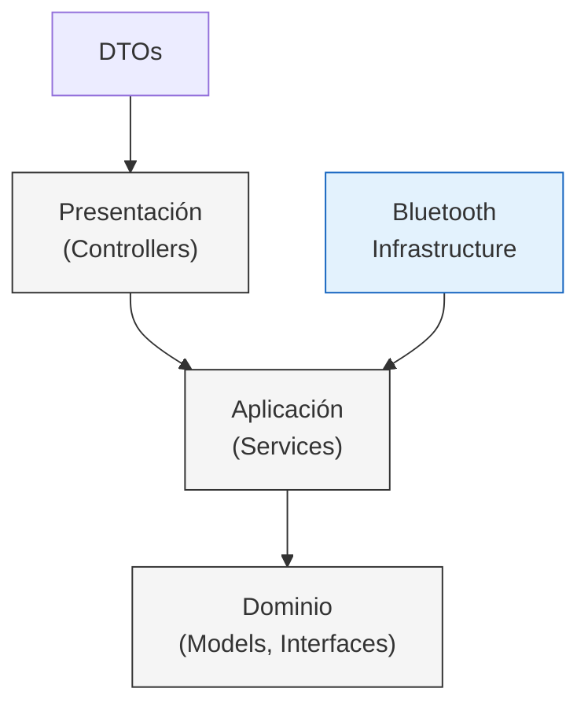
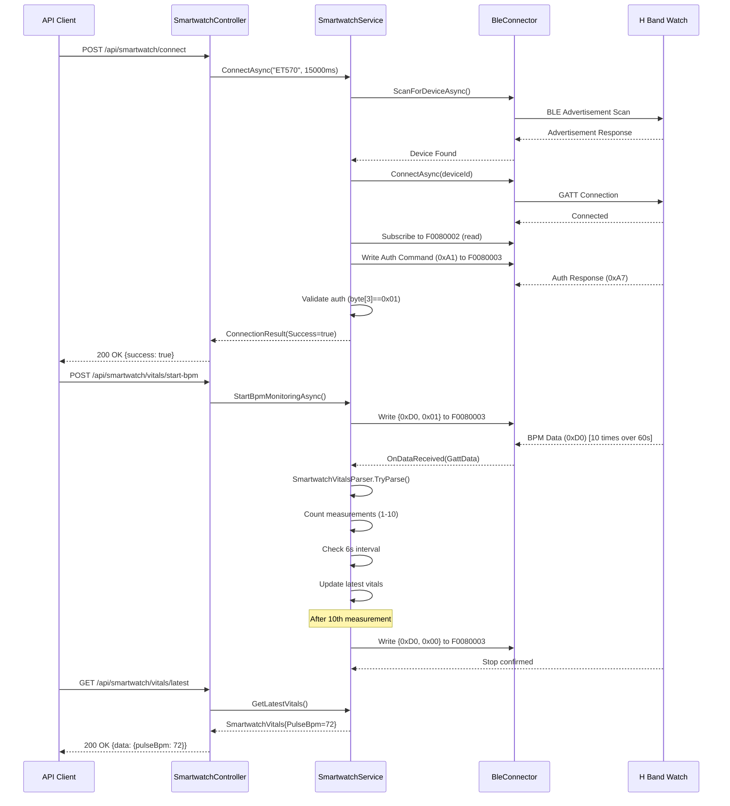

# Arquitectura del Backend - Control Panel API

**Gradus Technologies - Dpto. de Computo**				      					**01/02/2026**

**Jorge E. Peña** - CEO

---

## Estructura del Proyecto

```
📁 ControlPanel.API/
├── 🔷 Bluetooth/			# Infraestructura - Comunicación BLE
├── 🎛️ Controllers/       	 # Capa de Presentación - Endpoints API REST
├── 📝 DTOs/              	# Contratos de Transferencia de Datos
├── 📝 Interfaces/        	# Contratos de la Capa de Dominio
├── 🌀 Models/            	# Entidades del Dominio
├── 💫 Services/          	# Lógica de Aplicación e Implementaciones
└── 🟪 Program.cs         	# Punto de Entrada y Configuración
```

---

## 📁 Carpetas y Archivos

### 🔷 **Bluetooth/** - Capa de Infraestructura

Contiene las implementaciones concretas para la comunicación Bluetooth Low Energy (BLE) utilizando las APIs nativas de Windows.

#### Archivos:

- **`BleScanner.cs`**
  - **Responsabilidad:** Escaneo de dispositivos BLE cercanos.
  - **Implementa:** `IBleScanner`
  - **Funcionalidad:** Detecta dispositivos BLE mediante `BluetoothLEAdvertisementWatcher` de Windows y emite eventos cuando encuentra dispositivos.
  - **Patrón:** Infraestructura - Adaptador para APIs externas de Windows.

- **`BleConnector.cs`**
  - **Responsabilidad:** Conexión y comunicación con dispositivos BLE.
  - **Implementa:** `IBleConnector`
  - **Funcionalidad:** Establece conexiones GATT, lee/escribe características, maneja sesiones BLE y emite eventos cuando recibe datos.
  - **Patrón:** Infraestructura - Adaptador para APIs externas de Windows.

---

### 🎛️ **Controllers/** - Capa de Presentación

Expone los endpoints de la API REST y actúa como puente entre las solicitudes HTTP y la lógica de negocio.

#### Archivos:

- **`SerialController.cs`**
  - **Responsabilidad:** Gestionar la comunicación serial mediante HTTP.
  - **Rutas Base:** `/api/serial`
  - **Endpoints:**
    - `GET /ports` - Lista puertos COM disponibles.
    - `POST /connect` - Conecta a un puerto serial.
    - `POST /disconnect` - Desconecta puerto serial.
    - `POST /procesar-trama-real` - Envía tramas al dispositivo.
    - `GET /datos/{cabina}` - Obtiene datos de sensores parseados.
  - **Dependencias:** `ISerialService`
  - **Patrón:** Controlador MVC/API, Inyección de Dependencias.

- **`SmartwatchController.cs`**
  - **Responsabilidad:** Gestionar la conexión con smartwatches vía BLE y medición de signos vitales mediante HTTP.
  - **Rutas Base:** `/api/smartwatch`
  - **Endpoints:**
    - `POST /connect` - Escanea y conecta con un smartwatch BLE (por defecto "ET570").
    - `POST /disconnect` - Desconecta el smartwatch activo y guarda logs de sesión.
    - `GET /vitals/latest` - Obtiene las últimas lecturas de signos vitales disponibles.
    - `GET /vitals/history?limit=60` - Obtiene historial de signos vitales (máximo 300 registros).
    - `POST /vitals/start-bpm` - Inicia monitoreo de frecuencia cardíaca (10 mediciones en ~60s).
    - `POST /vitals/start-spo2` - Inicia monitoreo de oxigenación sanguínea (10 mediciones en ~60s).
  - **Dependencias:** `ISmartwatchService`
  - **Funcionalidades:**
    - Control de mediciones limitado: cada vital toma exactamente 10 muestras con intervalos de 6 segundos.
    - Auto-stop: el sistema detiene automáticamente el monitoreo después de 10 mediciones.
    - Medición secuencial: solo un vital puede ser monitoreado a la vez para evitar conflictos de protocolo.
  - **Patrón:** Controlador MVC/API, Inyección de Dependencias.

---

### 📝 **DTOs/** - Data Transfer Objects

Objetos simples para transferir datos entre capas, especialmente entre la API y los clientes.

#### Archivos:

- **`TramaRequest.cs`**
  - **Propósito:** Request para enviar tramas por puerto serial.
  - **Propiedades:** `PortName`, `Trama`.

- **`SmartwatchConnectRequest.cs`**
  - **Propósito:** Request para conectar un smartwatch.
  - **Propiedades:** `DeviceName`, `ScanTimeoutMs`.

- **`SmartwatchConnectResponse.cs`**
  - **Propósito:** Response de conexión exitosa/fallida del smartwatch.
  - **Propiedades:** `Success`, `Message`, `Device`.

- **`SmartwatchDisconnectResponse.cs`**
  - **Propósito:** Response de desconexión del smartwatch.
  - **Propiedades:** `Success`, `Message`.

**Patrón:** Data Transfer Object (DTO) - Contratos explícitos para entrada/salida de datos.

---

### 📝 **Interfaces/** - Contratos del Dominio

Define las abstracciones (interfaces) que desacoplan la lógica de negocio de las implementaciones concretas.

#### Archivos:

- **`ISerialService.cs`**
  - **Contrato:** Gestión de comunicación serial.
  - **Operaciones:** Listar puertos, conectar, desconectar, enviar tramas, obtener datos parseados.

- **`ISmartwatchService.cs`**
  - **Contrato:** Gestión de smartwatches BLE y medición de signos vitales.
  - **Operaciones:** 
    - `ConnectAsync(deviceName, timeout, cancellationToken)` - Escanea y conecta con smartwatch H Band.
    - `DisconnectAsync(cancellationToken)` - Desconecta smartwatch y finaliza sesión de logs.
    - `GetLatestVitals()` - Retorna último registro de signos vitales (`SmartwatchVitals?`).
    - `GetRecentVitals(maxCount)` - Retorna historial de vitales (máximo 300).
    - `StartBpmMonitoringAsync(cancellationToken)` - Inicia medición de BPM limitada a 10 muestras.
    - `StartSpO2MonitoringAsync(cancellationToken)` - Inicia medición de SpO2 limitada a 10 muestras.

- **`ITramaParser.cs`**
  - **Contrato:** Parseo de tramas seriales a objetos de dominio.
  - **Operaciones:** Convertir string crudo a `SensorData`.

- **`IBleScanner.cs`**
  - **Contrato:** Escaneo de dispositivos BLE.
  - **Operaciones:** Iniciar/detener escaneo, eventos de descubrimiento.

- **`IBleConnector.cs`**
  - **Contrato:** Conexión y comunicación BLE.
  - **Operaciones:** Conectar, desconectar, leer/escribir características GATT.

**Patrón:** Inversión de Dependencias (SOLID), Contratos de la Capa de Dominio.

---

### 🌀 **Models/** - Entidades del Dominio

Representan los objetos de negocio centrales del sistema.

#### Archivos:

- **`SensorData.cs`**
  - **Propósito:** Datos de sensores provenientes de las cabinas.
  - **Propiedades:** 
    - Identificación: `Cabina`
    - Acelerómetro: `X`, `Y`, `Z`
    - Sensores ambientales: `T` (temperatura), `H` (humedad), `UV`, `CO2`, `O3`, `dB`
    - Latencia: `Latencia`
    - Timestamp: `FechaHora`
  - **Uso:** Modelo de dominio que representa el estado de una cabina.

- **`WatchDevice.cs`**
  - **Propósito:** Información de un dispositivo smartwatch BLE detectado.
  - **Propiedades:** `Name`, `MacAddress`, `SignalStrength`.

- **`GattData.cs`**
  - **Propósito:** Datos recibidos desde características GATT del smartwatch.
  - **Propiedades:** `CharacteristicUuid`, `RawValue`, `TimestampUtc`.

- **`SmartwatchVitals.cs`**
  - **Propósito:** Registro de signos vitales obtenidos del smartwatch.
  - **Propiedades:** 
    - `PulseBpm` (double?) - Frecuencia cardíaca en pulsaciones por minuto (30-200 bpm).
    - `SpO2` (double?) - Oxigenación sanguínea en porcentaje (70-100%).
    - `TemperatureC` (double?) - Temperatura corporal en °C (30-45°C, pendiente).
    - `Systolic` (double?) - Presión arterial sistólica (80-200 mmHg, pendiente).
    - `Diastolic` (double?) - Presión arterial diastólica (50-120 mmHg, pendiente).
    - `TimestampUtc` (DateTime) - Marca de tiempo UTC de la lectura.
  - **Uso:** Modelo de dominio que representa el estado biométrico actual del usuario.
  - **Patrón:** Record inmutable (C# 9+).

**Patrón:** Entidades del Dominio, Plain Old CLR Objects (POCOs).

---

### 💫 **Services/** - Lógica de Aplicación

Implementaciones de la lógica de negocio y orquestación de operaciones.

#### Archivos:

- **`SerialService.cs`**
  - **Implementa:** `ISerialService`
  - **Responsabilidad:** 
    - Gestionar múltiples puertos seriales concurrentemente.
    - Almacenar historial de tramas recibidas.
    - Coordinar el parseo de tramas a `SensorData`.
  - **Dependencias:** `ITramaParser`
  - **Patrón:** Servicio de Aplicación, Repositorio en memoria (historial).

- **`SmartwatchService.cs`**
  - **Implementa:** `ISmartwatchService`
  - **Responsabilidad:** 
    - Orquestar el escaneo, conexión BLE y autenticación con smartwatch H Band.
    - Coordinar `IBleScanner`, `IBleConnector` y `SessionLogger`.
    - Gestionar el estado de conexión y ciclo de vida de sesiones.
    - Enviar comandos de medición (0xD0 BPM, 0xD2 SpO2) según protocolo H Band.
    - Controlar límite de 10 mediciones por vital con intervalos de 6 segundos.
    - Almacenar historial de signos vitales en memoria (máximo 300 registros).
    - Parsear datos recibidos mediante `SmartwatchVitalsParser`.
  - **Dependencias:** `IBleScanner`, `IBleConnector`, `SessionLogger`
  - **Protocolo H Band Implementado:**
    - **Autenticación (0xA1):** Envía password "0000" codificado + timestamp al conectar.
    - **Respuesta de Auth (0xA7):** Valida autenticación exitosa (byte[3] == 0x01).
    - **BPM (0xD0):** Comando {0xD0, 0x01} inicia monitoreo, {0xD0, 0x00} detiene.
    - **SpO2 (0xD2):** Comando {0xD2, 0x01} inicia monitoreo, {0xD2, 0x00} detiene.
    - **UUIDs GATT:**
      - Service: `F0080001-0451-4000-B000-000000000000` (Battery Service)
      - Read: `F0080002-0451-4000-B000-000000000000` (respuestas + datos)
      - Write: `F0080003-0451-4000-B000-000000000000` (comandos)
  - **Control de Mediciones:**
    - Cada vital (BPM/SpO2) toma exactamente 10 mediciones espaciadas 6 segundos (~60s total).
    - Auto-detiene el monitoreo al alcanzar 10 muestras enviando comando de STOP.
    - Solo permite un vital activo a la vez (restricción del protocolo H Band).
  - **Patrón:** Servicio de Aplicación, Coordinador, State Management.

- **`SmartwatchVitalsParser.cs`**
  - **Responsabilidad:** 
    - Parsear protocolo propietario H Band de bytes a objetos `SmartwatchVitals`.
    - Validar integridad de datos según especificaciones del fabricante.
    - Filtrar lecturas inválidas por estado o rango fuera de límites.
  - **Funcionalidad:**
    - Identifica tipo de dato por head byte (primer byte del paquete).
    - Convierte bytes firmados de Java a enteros sin signo (protocolo H Band).
    - Valida estado de medición (byte[5]): solo acepta 0, 2 o 3 como válidos.
    - Implementa rangos de seguridad:
      - BPM: 30-200 pulsaciones/min
      - SpO2: 70-100%
      - Temperatura: 30-45°C (pendiente)
      - Presión arterial: sistólica 80-200, diastólica 50-120 mmHg (pendiente)
  - **Head Bytes Implementados:**
    - `0xD0` (HEAD_RATE_CURRENT_READ) - BPM → `ParseHeartRate()`
    - `0xD2` (HEAD_SPO2H_ORIGAL) - SpO2 → `ParseSpO2()`
    - `0x88` (HEAD_TEMPTURE_ORIGAL) - Temperatura → `ParseTemperature()` (stub)
    - `0x90` (HEAD_BP) - Presión arterial → `ParseBloodPressure()` (stub)
    - `0xA7` (HEAD_PWD_RESPONSE) - Respuesta de autenticación (no parsea vitales)
    - `0xA1` (HEAD_AI_QA_STOP_RECORDING) - Control de grabación (no parsea vitales)
  - **UUIDs GATT Aceptados:**
    - `F0080002` (Battery Read) - Canal principal de datos
    - `F0030002` (UI Read) - Canal alternativo
    - `0000FEA1` (FEE7 Data) - Canal de estado
  - **Patrón:** Parser/Transformer, Strategy Pattern (switch por head byte).

- **`SessionLogger.cs`**
  - **Responsabilidad:** 
    - Capturar toda la salida de consola durante una sesión de smartwatch.
    - Generar archivos de log con timestamp en formato `smartwatch-session-YYYY-MM-DD_HH-mm-ss.txt`.
    - Gestionar el ciclo de vida del logging (inicio/fin de sesión).
  - **Funcionalidad:**
    - Redirecciona `Console.Out` a un buffer en memoria durante la sesión.
    - Guarda logs automáticamente al desconectar el smartwatch.
    - Almacena logs en carpeta `Logs/` relativa al directorio de ejecución.
    - Mantiene copia de salida en consola original para debugging en tiempo real.
  - **Patrón:** Decorator Pattern (TextWriter wrapper), Session Management.

- **`TramaParser.cs`**
  - **Implementa:** `ITramaParser`
  - **Responsabilidad:** 
    - Convertir tramas seriales crudas (strings) a objetos `SensorData`.
    - Validar formato y parsear valores.
  - **Patrón:** Parser/Transformer, Lógica de Dominio.

---

### 🟪 **Program.cs** - Punto de Entrada

Archivo de configuración y arranque de la aplicación.

#### Responsabilidades:

1. **Inyección de Dependencias:**
   - **Serial Services:**
     - Registra `ITramaParser` → `TramaParser`
     - Registra `ISerialService` → `SerialService`
   - **Smartwatch Services:**
     - Registra `IBleScanner` → `BleScanner`
     - Registra `IBleConnector` → `BleConnector`
     - Registra `SessionLogger` (singleton)
     - Registra `ISmartwatchService` → `SmartwatchService`

2. **Configuración CORS:**
   - Política `AllowAll` para permitir cualquier origen (desarrollo).

3. **Servir Frontend:**
   - Sirve archivos estáticos desde `wwwroot` (build de Astro).
   - Configura fallback a `index.html` para SPA routing.

4. **API REST:**
   - Mapea controladores en `/api/*`.
   - Puerto: `http://localhost:5000`.

**Patrón:** Composition Root, Configuración de Infraestructura.

---

## 🏛️ Principios de Clean Architecture Aplicados

### 1. **Dependencias Dirigidas Hacia el Dominio**
- Los **Controllers** dependen de **Interfaces**, no de implementaciones concretas.
- Los **Services** implementan **Interfaces** y dependen de otras interfaces.
- La **Infraestructura** (Bluetooth) implementa interfaces definidas en el dominio.

### 2. **Separación de Capas**



### 3. **Inversión de Control**
- Las interfaces (`I*`) definen contratos.
- Las implementaciones concretas se inyectan en tiempo de ejecución vía DI.

### 4. **Responsabilidad Única**
- Cada clase/archivo tiene una única razón para cambiar:
  - `BleScanner` → Solo escaneo BLE.
  - `BleConnector` → Solo conexión y comunicación GATT.
  - `SmartwatchService` → Solo orquestación de smartwatch y control de mediciones.
  - `SmartwatchVitalsParser` → Solo parseo de protocolo H Band.
  - `SessionLogger` → Solo captura de logs de sesión.
  - `SerialService` → Solo lógica serial.
  - `TramaParser` → Solo parseo de tramas seriales.

---

## 🔧 Tecnologías Utilizadas

- **.NET 10.0** - Framework de aplicación
- **ASP.NET Core** - Framework web y API REST
- **System.IO.Ports** - Comunicación serial (puerto COM)
- **Windows.Devices.Bluetooth.GenericAttributeProfile** - GATT para BLE de Windows
- **Windows.Devices.Bluetooth.Advertisement** - Escaneo BLE de Windows
- **Inyección de Dependencias nativa** - Contenedor IoC de .NET
- **Protocolo H Band propietario** - Reverse-engineered desde APK decompilado

---

## 🩺 Protocolo H Band - Detalles Técnicos

### Autenticación

**Comando (0xA1):**
```csharp
byte[] authCmd = {
    0xA1,                          // Head byte (autenticación)
    0x00, 0x00, 0x00,             // Reserved bytes
    (byte)year, (byte)month,       // Timestamp: año, mes
    (byte)day, (byte)hour,         // día, hora
    (byte)minute, (byte)second,    // minuto, segundo
    0x00, 0x00, 0x00,             // Reserved
    0x30, 0x30, 0x30, 0x30,       // Password "0000" en ASCII
    0x00, 0x00, 0x00              // Flags
};
```

**Respuesta (0xA7):**
```csharp
// Estructura de respuesta (20 bytes típicos):
// [0]    = 0xA7 (head byte)
// [1-2]  = Reserved
// [3]    = Auth status (0x01 = success, 0x00 = fail)
// [4-5]  = Reserved
// [6-8]  = Firmware version (major.minor.patch)
// [9-19] = Device settings
```

### Medición de BPM (0xD0)

**Comandos:**
```csharp
byte[] startBpm = { 0xD0, 0x01 };  // Iniciar monitoreo
byte[] stopBpm  = { 0xD0, 0x00 };  // Detener monitoreo
```

**Datos recibidos:**
```csharp
// Estructura de datos BPM (6+ bytes):
// [0] = 0xD0 (head byte)
// [1] = BPM value (30-200)
// [2-4] = Reserved
// [5] = State (0/2/3 = válido, otros = inválido/midiendo)
// [6+] = Optional extended data
```

### Medición de SpO2 (0xD2)

**Comandos:**
```csharp
byte[] startSpO2 = { 0xD2, 0x01 };  // Iniciar monitoreo
byte[] stopSpO2  = { 0xD2, 0x00 };  // Detener monitoreo
```

**Datos recibidos:**
```csharp
// Estructura de datos SpO2 (6+ bytes):
// [0] = 0xD2 (head byte)
// [1] = SpO2 percentage (70-100)
// [2-4] = Reserved
// [5] = State (0/2/3 = válido, otros = inválido/midiendo)
// [6+] = Optional extended data
```

### Servicios y Características GATT

| Servicio | UUID | Propósito |
|----------|------|-----------|
| Battery Service | `F0080001-0451-4000-B000-000000000000` | Servicio principal |
| Battery Read | `F0080002-0451-4000-B000-000000000000` | Canal de lectura (notify) |
| Battery Config | `F0080003-0451-4000-B000-000000000000` | Canal de escritura (write) |
| UI Service | `F0030001-0451-4000-B000-000000000000` | Servicio alternativo |
| UI Notify | `F0030002-0451-4000-B000-000000000000` | Notificaciones UI |
| FEE7 Service | `0000FEE7-0000-1000-8000-00805F9B34FB` | Servicio de estado |
| FEE7 Data | `0000FEA1-0000-1000-8000-00805F9B34FB` | Canal de datos FEE7 |

### Flujo de Conexión y Medición



### Estados de Medición

| State Byte | Significado | Acción |
|------------|-------------|--------|
| `0` | Medición válida completada | Aceptar valor |
| `2` | Medición válida en progreso | Aceptar valor |
| `3` | Medición válida estabilizada | Aceptar valor |
| `1` | Error de uso (mal colocado) | Rechazar |
| `4+` | Estado desconocido | Rechazar |

### Control de Límite de Mediciones

```csharp
// Lógica implementada en SmartwatchService.HandleGattData()
private const int MAX_BPM_MEASUREMENTS = 10;
private const int BPM_MEASUREMENT_INTERVAL_MS = 6000; // 60s / 10 = 6s

// Cada vez que llega un dato válido:
if (update.PulseBpm.HasValue && _bpmMonitoringActive) {
    var timeSinceLastMeasurement = (DateTime.UtcNow - _lastBpmMeasurementTime).TotalMilliseconds;
    
    // Solo contar si han pasado 6 segundos (evita duplicados)
    if (timeSinceLastMeasurement >= BPM_MEASUREMENT_INTERVAL_MS || _bpmMeasurementCount == 0) {
        _bpmMeasurementCount++;
        _lastBpmMeasurementTime = DateTime.UtcNow;
        
        // Auto-stop después de 10 mediciones
        if (_bpmMeasurementCount >= MAX_BPM_MEASUREMENTS) {
            await StopBpmMonitoringAsync(CancellationToken.None);
        }
    }
}
```

**Justificación del diseño:**
- **10 mediciones:** Muestra estadísticamente significativa sin ser excesiva.
- **6 segundos de intervalo:** Permite estabilización del sensor entre lecturas.
- **60 segundos totales:** Tiempo razonable para una sesión de medición completa.
- **Auto-stop:** Libera el reloj para medir otros vitales sin intervención manual.
- **Medición secuencial:** El protocolo H Band solo soporta un tipo de medición activa simultáneamente.

---

## 🔬 Pendientes de Implementación

### Temperatura Corporal (0x88)
- **Comando Start:** `{0x88, 0x01}`
- **Comando Stop:** `{0x88, 0x00}`
- **Rango esperado:** 30-45°C
- **Estado:** Parser stub creado, pendiente validación con hardware real.

### Presión Arterial (0x90)
- **Comando Start:** `{0x90, 0x01}`
- **Comando Stop:** `{0x90, 0x00}`
- **Datos esperados:**
  - `byte[1]` = Sistólica (80-200 mmHg)
  - `byte[2]` = Diastólica (50-120 mmHg)
- **Estado:** Parser stub creado, pendiente validación con hardware real.

### Frontend - Selector de Vitales
- **Requisito:** UI para seleccionar qué vital medir (BPM/SpO2/Temp/BP).
- **Comportamiento:** 
  - Botón por cada vital disponible.
  - Deshabilitar otros botones durante medición activa.
  - Mostrar gráfica en tiempo real del vital seleccionado.
  - Indicador de progreso: "Midiendo... 3/10 muestras".
- **Estado:** Pendiente diseño e implementación.

---

## 🚀 Ejecución

### Requisitos
- Windows 10/11 (por dependencias BLE de Windows)
- .NET 10.0 SDK
- Puerto serial o dispositivo BLE para pruebas
- Smartwatch compatible con protocolo H Band (ET570 recomendado)

### Comandos
```bash
# Restaurar dependencias
dotnet restore

# Compilar
dotnet build

# Ejecutar
dotnet run --project ControlPanel.API/ControlPanel.API.csproj

# La API estará disponible en:
# http://localhost:5000
```

### Endpoints de Prueba

**Conectar Smartwatch:**
```bash
curl -X POST http://localhost:5000/api/smartwatch/connect \
  -H "Content-Type: application/json" \
  -d '{"deviceName": "ET570", "scanTimeoutMs": 15000}'
```

**Iniciar BPM:**
```bash
curl -X POST http://localhost:5000/api/smartwatch/vitals/start-bpm
```

**Obtener Vitales:**
```bash
curl http://localhost:5000/api/smartwatch/vitals/latest
```

**Desconectar:**
```bash
curl -X POST http://localhost:5000/api/smartwatch/disconnect
```

---

## 📚 Referencias

- [Clean Architecture by Robert C. Martin](https://blog.cleancoder.com/uncle-bob/2012/08/13/the-clean-architecture.html)
- [ASP.NET Core Documentation](https://docs.microsoft.com/en-us/aspnet/core/)
- [Windows BLE APIs](https://docs.microsoft.com/en-us/windows/uwp/devices-sensors/bluetooth)
- [GATT Specifications](https://www.bluetooth.com/specifications/specs/generic-attribute-profile-1-0/)
- [H Band Protocol](https://github.com/topics/h-band) - Referencia de protocolo propietario reverse-engineered
