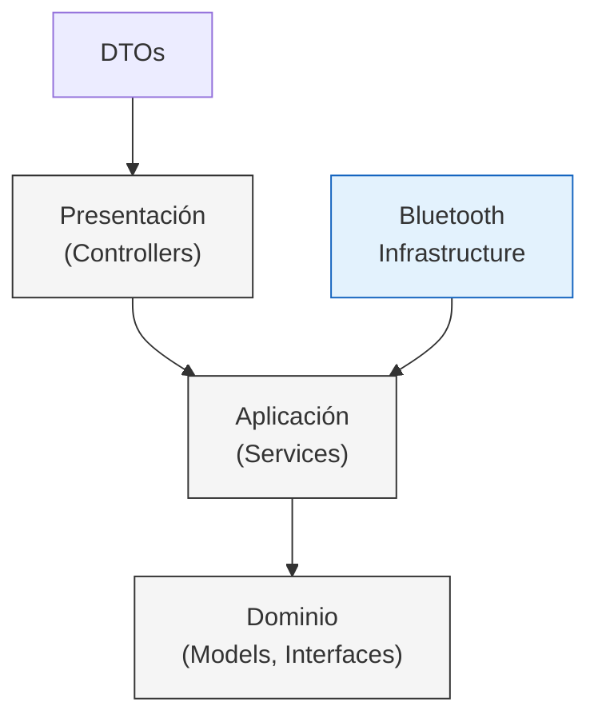

# Arquitectura del Backend - Control Panel API

**Gradus Technologies - Dpto. de Computo**				      					**01/02/2026**

**Jorge E. Peña** - CEO															

---

## Estructura del Proyecto

```
📁 ControlPanel.API/
├── 🔷 Bluetooth/			# Infraestructura - Comunicación BLE
├── 🎛️ Controllers/       	 # Capa de Presentación - Endpoints API REST
├── 📝 DTOs/              	# Contratos de Transferencia de Datos
├── 📝 Interfaces/        	# Contratos de la Capa de Dominio
├── 🌀 Models/            	# Entidades del Dominio
├── 💫 Services/          	# Lógica de Aplicación e Implementaciones
└── 🟪 Program.cs         	# Punto de Entrada y Configuración
```

---

## 📁 Carpetas y Archivos

### 🔷 **Bluetooth/** - Capa de Infraestructura

Contiene las implementaciones concretas para la comunicación Bluetooth Low Energy (BLE) utilizando las APIs nativas de Windows.

#### Archivos:

- **`BleScanner.cs`**
  - **Responsabilidad:** Escaneo de dispositivos BLE cercanos.
  - **Implementa:** `IBleScanner`
  - **Funcionalidad:** Detecta dispositivos BLE mediante `BluetoothLEAdvertisementWatcher` de Windows y emite eventos cuando encuentra dispositivos.
  - **Patrón:** Infraestructura - Adaptador para APIs externas de Windows.

- **`BleConnector.cs`**
  - **Responsabilidad:** Conexión y comunicación con dispositivos BLE.
  - **Implementa:** `IBleConnector`
  - **Funcionalidad:** Establece conexiones GATT, lee/escribe características, maneja sesiones BLE y emite eventos cuando recibe datos.
  - **Patrón:** Infraestructura - Adaptador para APIs externas de Windows.

---

### 🎛️ **Controllers/** - Capa de Presentación

Expone los endpoints de la API REST y actúa como puente entre las solicitudes HTTP y la lógica de negocio.

#### Archivos:

- **`SerialController.cs`**
  - **Responsabilidad:** Gestionar la comunicación serial mediante HTTP.
  - **Rutas Base:** `/api/serial`
  - **Endpoints:**
    - `GET /ports` - Lista puertos COM disponibles.
    - `POST /connect` - Conecta a un puerto serial.
    - `POST /disconnect` - Desconecta puerto serial.
    - `POST /procesar-trama-real` - Envía tramas al dispositivo.
    - `GET /datos/{cabina}` - Obtiene datos de sensores parseados.
  - **Dependencias:** `ISerialService`
  - **Patrón:** Controlador MVC/API, Inyección de Dependencias.

- **`SmartwatchController.cs`**
  - **Responsabilidad:** Gestionar la conexión con smartwatches vía BLE mediante HTTP.
  - **Rutas Base:** `/api/smartwatch`
  - **Endpoints:**
    - `POST /connect` - Escanea y conecta con un smartwatch BLE.
    - `POST /disconnect` - Desconecta el smartwatch activo.
  - **Dependencias:** `ISmartwatchService`
  - **Patrón:** Controlador MVC/API, Inyección de Dependencias.

---

### 📝 **DTOs/** - Data Transfer Objects

Objetos simples para transferir datos entre capas, especialmente entre la API y los clientes.

#### Archivos:

- **`TramaRequest.cs`**
  - **Propósito:** Request para enviar tramas por puerto serial.
  - **Propiedades:** `PortName`, `Trama`.

- **`SmartwatchConnectRequest.cs`**
  - **Propósito:** Request para conectar un smartwatch.
  - **Propiedades:** `DeviceName`, `ScanTimeoutMs`.

- **`SmartwatchConnectResponse.cs`**
  - **Propósito:** Response de conexión exitosa/fallida del smartwatch.
  - **Propiedades:** `Success`, `Message`, `Device`.

- **`SmartwatchDisconnectResponse.cs`**
  - **Propósito:** Response de desconexión del smartwatch.
  - **Propiedades:** `Success`, `Message`.

**Patrón:** Data Transfer Object (DTO) - Contratos explícitos para entrada/salida de datos.

---

### 📝 **Interfaces/** - Contratos del Dominio

Define las abstracciones (interfaces) que desacoplan la lógica de negocio de las implementaciones concretas.

#### Archivos:

- **`ISerialService.cs`**
  - **Contrato:** Gestión de comunicación serial.
  - **Operaciones:** Listar puertos, conectar, desconectar, enviar tramas, obtener datos parseados.

- **`ISmartwatchService.cs`**
  - **Contrato:** Gestión de smartwatches BLE.
  - **Operaciones:** Conectar, desconectar, obtener estado.

- **`ITramaParser.cs`**
  - **Contrato:** Parseo de tramas seriales a objetos de dominio.
  - **Operaciones:** Convertir string crudo a `SensorData`.

- **`IBleScanner.cs`**
  - **Contrato:** Escaneo de dispositivos BLE.
  - **Operaciones:** Iniciar/detener escaneo, eventos de descubrimiento.

- **`IBleConnector.cs`**
  - **Contrato:** Conexión y comunicación BLE.
  - **Operaciones:** Conectar, desconectar, leer/escribir características GATT.

**Patrón:** Inversión de Dependencias (SOLID), Contratos de la Capa de Dominio.

---

### 🌀 **Models/** - Entidades del Dominio

Representan los objetos de negocio centrales del sistema.

#### Archivos:

- **`SensorData.cs`**
  - **Propósito:** Datos de sensores provenientes de las cabinas.
  - **Propiedades:** 
    - Identificación: `Cabina`
    - Acelerómetro: `X`, `Y`, `Z`
    - Sensores ambientales: `T` (temperatura), `H` (humedad), `UV`, `CO2`, `O3`, `dB`
    - Latencia: `Latencia`
    - Timestamp: `FechaHora`
  - **Uso:** Modelo de dominio que representa el estado de una cabina.

- **`WatchDevice.cs`**
  - **Propósito:** Información de un dispositivo smartwatch BLE detectado.
  - **Propiedades:** `Name`, `MacAddress`, `SignalStrength`.

- **`GattData.cs`**
  - **Propósito:** Datos recibidos desde características GATT del smartwatch.
  - **Propiedades:** `CharacteristicUuid`, `Data`.

**Patrón:** Entidades del Dominio, Plain Old CLR Objects (POCOs).

---

### 💫 **Services/** - Lógica de Aplicación

Implementaciones de la lógica de negocio y orquestación de operaciones.

#### Archivos:

- **`SerialService.cs`**
  - **Implementa:** `ISerialService`
  - **Responsabilidad:** 
    - Gestionar múltiples puertos seriales concurrentemente.
    - Almacenar historial de tramas recibidas.
    - Coordinar el parseo de tramas a `SensorData`.
  - **Dependencias:** `ITramaParser`
  - **Patrón:** Servicio de Aplicación, Repositorio en memoria (historial).

- **`SmartwatchService.cs`**
  - **Implementa:** `ISmartwatchService`
  - **Responsabilidad:** 
    - Orquestar el escaneo y conexión BLE.
    - Coordinar `IBleScanner` e `IBleConnector`.
    - Gestionar el estado de conexión del smartwatch.
  - **Dependencias:** `IBleScanner`, `IBleConnector`
  - **Patrón:** Servicio de Aplicación, Coordinador.

- **`TramaParser.cs`**
  - **Implementa:** `ITramaParser`
  - **Responsabilidad:** 
    - Convertir tramas seriales crudas (strings) a objetos `SensorData`.
    - Validar formato y parsear valores.
  - **Patrón:** Parser/Transformer, Lógica de Dominio.

---

### 🟪 **Program.cs** - Punto de Entrada

Archivo de configuración y arranque de la aplicación.

#### Responsabilidades:

1. **Inyección de Dependencias:**
   - Registra `ITramaParser` → `TramaParser`
   - Registra `ISerialService` → `SerialService`
   - Registra `ISmartwatchService` → `SmartwatchService`

2. **Configuración CORS:**
   - Política `AllowAll` para permitir cualquier origen (desarrollo).

3. **Servir Frontend:**
   - Sirve archivos estáticos desde `wwwroot` (build de Astro).
   - Configura fallback a `index.html` para SPA routing.

4. **API REST:**
   - Mapea controladores en `/api/*`.
   - Puerto: `http://localhost:5000`.

**Patrón:** Composition Root, Configuración de Infraestructura.

---

## 🏛️ Principios de Clean Architecture Aplicados

### 1. **Dependencias Dirigidas Hacia el Dominio**
- Los **Controllers** dependen de **Interfaces**, no de implementaciones concretas.
- Los **Services** implementan **Interfaces** y dependen de otras interfaces.
- La **Infraestructura** (Bluetooth) implementa interfaces definidas en el dominio.

### 2. **Separación de Capas**



### 3. **Inversión de Control**
- Las interfaces (`I*`) definen contratos.
- Las implementaciones concretas se inyectan en tiempo de ejecución vía DI.

### 4. **Responsabilidad Única**
- Cada clase/archivo tiene una única razón para cambiar:
  - `BleScanner` → Solo escaneo BLE.
  - `SerialService` → Solo lógica serial.
  - `TramaParser` → Solo parseo de tramas.

---

## 🔧 Tecnologías Utilizadas

- **.NET 10.0** - Framework de aplicación
- **ASP.NET Core** - Framework web y API REST
- **System.IO.Ports** - Comunicación serial (puerto COM)
- **Windows.Devices.Bluetooth** - APIs de Bluetooth LE de Windows
- **Inyección de Dependencias nativa** - Contenedor IoC de .NET

---

## 🚀 Ejecución

### Requisitos
- Windows 10/11 (por dependencias BLE de Windows)
- .NET 10.0 SDK
- Puerto serial o dispositivo BLE para pruebas

### Comandos
```bash
# Restaurar dependencias
dotnet restore

# Compilar
dotnet build

# Ejecutar
dotnet run --project ControlPanel.API/ControlPanel.API.csproj

# La API estará disponible en:
# http://localhost:5000
```

---

## 📚 Referencias

- [Clean Architecture by Robert C. Martin](https://blog.cleancoder.com/uncle-bob/2012/08/13/the-clean-architecture.html)
- [ASP.NET Core Documentation](https://docs.microsoft.com/en-us/aspnet/core/)
- [Windows BLE APIs](https://docs.microsoft.com/en-us/windows/uwp/devices-sensors/bluetooth)
