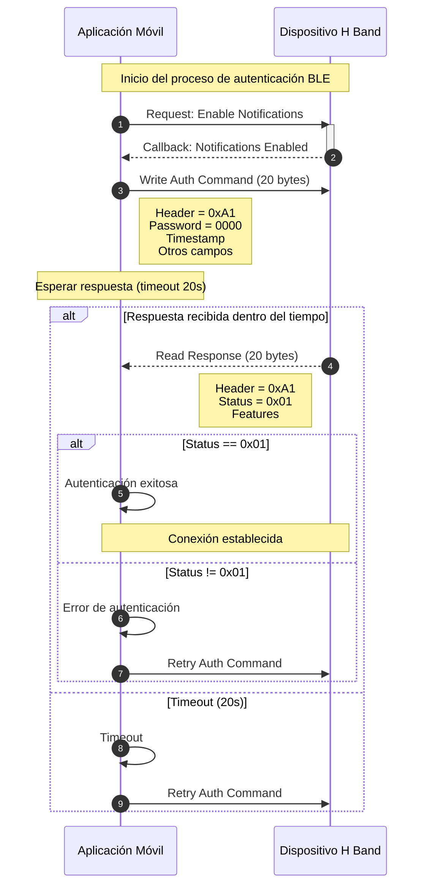

# H Band APK - Reporte del Protocolo de Autenticación del Dispositivo

**Gradus Technologies - Dpto. de Computo**				      					**01/02/2026**

**Jorge E. Peña** - CEO

---

El smartwatch H Band usa un mecanismo de autenticación BLE que:
- Envía un password por defecto **"0000"** (4 dígitos numéricos)
- Convierte el password a un entero de 4 bytes junto con el timestamp del sistema
- Transmite vía el **Battery Service (F0080001)** en la característica **F0080003**
- El dispositivo responde con un código de éxito/fallo en `byte[3]`

---

## 1. Password por Defecto

### Valor Exacto
```
DEFAULT_PWD = "0000"
Tipo: String (4 dígitos ASCII)
```

**Archivo Fuente:** `BluetoothService.java`, Línea 173
```java
private static final String DEFAULT_PWD = "0000";
```

### Uso
- Se usa como fallback si no hay password personalizado guardado
- Se valida en el método `getPwdCmd()`
- Se utiliza en la primera conexión si el password está vacío

---

## 2. Algoritmo de Generación del Password

### Método: `pwdTrans(String str, byte b, boolean z, boolean z2)`

**Ubicación:** `PwdHandler.java`, Líneas 107-129

### Pasos del Algoritmo

1. **Convertir string de password a entero:**
   ```java
   Integer.parseInt(str, 10)  // "0000" → 0
   ```

2. **Convertir entero a arreglo de bytes (little-endian):**
   ```java
   byte[] bArrIntToBytes = ConvertHelper.intToBytes(i);
   ```
   - Para password "0000": `[0x00, 0x00, 0x00, 0x00]`

3. **Obtener tiempo del sistema como arreglo de 7 bytes:**
   ```java
   byte[] sysBytetime = getSysBytetime();
   // Retorna: [year_high, year_low, month, day, hour, minute, second]
   ```

4. **Construir frame de autenticación de 20 bytes:**

```java
byte[] bArr = new byte[20];
bArr[0] = -95;                          // HEAD_PWD (0xA1)
bArr[1] = bArrIntToBytes[3];            // Password byte 3 (LSB)
bArr[2] = bArrIntToBytes[2];            // Password byte 2
bArr[3] = b;                            // Código de comando (0x00 = check)
bArr[4-10] = sysBytetime[0-6];          // Tiempo del sistema (7 bytes)
bArr[11] = z ? 1 : 0;                   // Flag formato 24 horas
bArr[12] = 1;                           // Constante fija
bArr[13] = (byte)TimeUtil.getLocalTimezone15Min();  // Zona horaria
bArr[14] = z2 ? 1 : 0;                  // Flag conexión manual
// bArr[15-19] quedan en 0x00 (padding)
```

### Estructura del Frame (20 bytes en total)

| Byte | Hex  | Descripción | Ejemplo |
|------|------|-------------|---------|
| 0    | A1   | Header del comando (HEAD_PWD) | -95 (0xA1) |
| 1-2  | XXXX | Password (little-endian, invertido) | 0x00, 0x00 |
| 3    | 00   | Tipo de comando (0=check, 1=verify, 3=set) | 0x00 |
| 4-10 | XXXX | Timestamp del sistema (7 bytes) | [YY_H, YY_L, MM, DD, HH, mm, ss] |
| 11   | 01   | Formato 24 horas (0x00 o 0x01) | 0x01 |
| 12   | 01   | Byte fijo | 0x01 |
| 13   | XX   | Offset de zona horaria en unidades de 15 min | varía |
| 14   | 00   | Flag conexión manual | 0x00 o 0x01 |
| 15-19| 00   | Padding ceros | 0x00 |

### Ejemplo: Password por defecto "0000" con timestamp 2026-02-01 20:30:45

```
Hex: A1 00 00 00 7E 0A 02 01 14 1E 2D 01 01 04 00 00 00 00 00 00
     └─ Header
        └──────────── Password (0000 = 0x00000000)
                  └─ Comando (0x00 = autenticación)
                     └─────────────────── Timestamp (2026-02-01 20:30:45)
                                    └─── Formato 24 horas (sí)
                                       └─ Byte fijo
                                          └ Zona horaria (+60 min = +04 unidades de 15 min)
                                            └ Flag manual (no)
```

---

## 3. Detalles de Transmisión BLE

### Servicio y Característica

| Propiedad | Valor |
|----------|-------|
| **Service UUID** | `F0080001-0451-4000-B000-000000000000` |
| **Characteristic** | `F0080003-0451-4000-B000-000000000000` (BATTERY_CONFIG_UUID) |
| **Operación** | Write (write sin respuesta) |

**Fuente:** `BleProfile.java`, Líneas 149-150
```java
public static final UUID BATTERY_SERVICE_UUID = UUID.fromString("F0080001-0451-4000-B000-000000000000");
public static final UUID BATTERY_CONFIG_UUID = UUID.fromString("F0080003-0451-4000-B000-000000000000");
```

### Operación de Escritura

**Fuente:** `BluetoothService.java`, Líneas 2039-2045

```java
public void sendPasswordCheckCmd() throws InterruptedException {
    final byte[] pwdCmd = getPwdCmd();
    Logger.t(PWD_ACTION).e("发送密码==》 cmd = " + ConvertHelper.byte2HexForShow(pwdCmd));
    writeCharacteristic(BATTERY_SERVICE_UUID, BATTERY_CONFIG_UUID, pwdCmd);
    // Wait timeout: 20 seconds
}
```

---

## 4. Parseo de la Respuesta

### Formato de Respuesta

El dispositivo responde vía **BATTERY_READ_UUID** (`F0080002-0451-4000-B000-000000000000`)

**Estructura de respuesta:**
- Longitud mínima: 20 bytes
- **Byte 0:** 0xA1 (eco del header de comando)
- **Byte 3:** Código de estado
- **Bytes 10-19:** Flags de estado del dispositivo

### Códigos de Estado (Byte 3)

| Valor | Enum | Significado |
|-------|------|-------------|
| **0x01** | CHECK_SUCCESS | ✅ Verificación de password exitosa |
| **0x00** | CHECK_FAIL | ❌ Verificación de password fallida |
| **0x03** | SETTING_SUCCESS | ✅ Password configurado exitosamente |
| **0x02** | SETTING_FAIL | ❌ Configuración de password fallida |
| **0x05** | READ_SUCCESS | ✅ Lectura de password exitosa |
| **0x04** | READ_FAIL | ❌ Lectura de password fallida |
| **0x06** | CHECK_AND_TIME_SUCCESS | ✅ Password + tiempo verificados |

**Fuente:** `PwdHandler.java`, Líneas 30-81
```java
public enum Pwd {
    CHECK_FAIL,              // 0x00
    CHECK_SUCCESS,           // 0x01
    SETTING_FAIL,            // 0x02
    SETTING_SUCCESS,         // 0x03
    READ_FAIL,               // 0x04
    READ_SUCCESS,            // 0x05
    CHECK_AND_TIME_SUCCESS,  // 0x06
    UNKNOW
}
```

### Código de Manejo de Respuesta

**Fuente:** `PwdHandler.java`, Líneas 40-81

```java
public static Pwd getReturnData(Context context, byte[] bArr) {
    if (bArr.length < 20) {
        return Pwd.UNKNOW;
    }
    byte b = bArr[3];  // Código de estado
    
    // Extraer features del dispositivo
    AppSPUtil.setPWDDfuLangState(bArr[10] == 1);
    byte b2 = bArr[11];  // Feature turn handler
    byte b3 = bArr[18];  // Feature find phone
    byte b4 = bArr[19];  // Feature wear check
    
    // Evaluar estado
    if (b == 1) {
        return Pwd.CHECK_SUCCESS;
    } else if (b == 0) {
        return Pwd.CHECK_FAIL;
    } else if (b == 3) {
        return Pwd.SETTING_SUCCESS;
    } else if (b == 2) {
        return Pwd.SETTING_FAIL;
    } else if (b == 5) {
        return Pwd.READ_SUCCESS;
    } else if (b == 4) {
        return Pwd.READ_FAIL;
    } else if (b == 6) {
        return Pwd.CHECK_AND_TIME_SUCCESS;
    }
    return Pwd.UNKNOW;
}
```

---

## 5. Flujo Completo de Autenticación

### Diagrama de Secuencia



### Comportamiento de Timeout

- **Timeout normal:** 20 segundos
- **Después de timeout sin respuesta:**
  1. Log de error: "密码校验【无返回】"
  2. Revisa flag `IS_PWD_4_SECOND_NOT_CALLBACK_DISCONNECT`
  3. Si es `true`: Desconecta y reconecta
  4. Si es `false`: Reintenta el mismo comando con `bArr[14] = 0`

**Fuente:** `BluetoothService.java`, Líneas 2047-2075

---

## 6. Fragmentos de Código de Implementación

### Generación del Comando de Autenticación (Java)

```java
// From PwdHandler.java
public static byte[] pwdTrans(String str, byte b, boolean z, boolean z2) 
        throws NumberFormatException {
    int i;
    try {
        i = Integer.parseInt(str, 10);
    } catch (Exception e) {
        e.printStackTrace();
        i = 0;
    }
    
    byte[] bArrIntToBytes = ConvertHelper.intToBytes(i);
    byte[] sysBytetime = getSysBytetime();
    
    byte[] bArr = new byte[20];
    bArr[0] = -95;                          // 0xA1
    bArr[1] = bArrIntToBytes[3];            // Password LSB
    bArr[2] = bArrIntToBytes[2];            // Password
    bArr[3] = b;                            // Tipo de comando
    
    // Copiar timestamp
    for (int x = 0; x < 7; x++) {
        bArr[4 + x] = sysBytetime[x];
    }
    
    bArr[11] = z ? (byte) 1 : (byte) 0;     // Formato 24 horas
    bArr[12] = 1;
    bArr[13] = (byte) TimeUtil.getLocalTimezone15Min();
    bArr[14] = z2 ? (byte) 1 : (byte) 0;    // Conexión manual
    
    return bArr;
}

// From BluetoothService.java
public byte[] getPwdCmd() {
    if (TextUtils.isEmpty(this.password)) {
        this.password = DEFAULT_PWD;  // "0000"
    }
    return PwdHandler.pwdTrans(this.password, (byte) 0, 
            DateFormat.is24HourFormat(this.mContext), 
            isManualConnect());
}
```

### Escritura BLE

```java
// From BluetoothService.java
private void sendPasswordCheckCmd() throws InterruptedException {
    final byte[] pwdCmd = getPwdCmd();
    
    Logger.t(PWD_ACTION).e("发送密码==》 cmd = " + 
            ConvertHelper.byte2HexForShow(pwdCmd));
    
    writeCharacteristic(BATTERY_SERVICE_UUID, 
                       BATTERY_CONFIG_UUID, 
                       pwdCmd);
    
    // Set 20-second timeout
    this.mHandler.postDelayed(() -> {
        if (!SpUtil.getBoolean(mContext, "BLE_PWD_CALLBACK", false)) {
            // Manejo de timeout - reconectar o reintentar
        }
    }, 20000);
}
```

---

## 7. Archivos Clave Identificados

| Archivo | Propósito |
|------|---------|
| `PwdHandler.java` | Construcción del frame de password y parseo de respuesta |
| `BluetoothService.java` | Orquestación de comunicación BLE |
| `BleProfile.java` | UUIDs de servicios/características y constantes |
| `ConvertHelper.java` | Utilidades de conversión int-to-bytes |
| `TimeUtil.java` | Cálculo de zona horaria |

---

## 8. Notas de Seguridad

### Debilidades
1. **Password por defecto "0000"** - Todos los dispositivos salen igual
2. **Sin cifrado** - Password se envía en texto plano por BLE
3. **Sin nonce/replay protection** - La estructura usa timestamp predecible
4. **Sin salting** - Password convertido directo a entero

### Aspectos Positivos
1. Incluye timestamp del dispositivo
2. Incluye offset de zona horaria
3. Incluye flag de tipo de conexión
4. Soporta cambio de password (byte[3] = 0x03)

---

## 9. Referencia Rápida - Comando de Autenticación

### Para password "0000", UTC 2026-02-01 20:34:44

```
Hex Dump:
A1 00 00 00 7E 0A 02 01 14 22 2C 01 01 00 00 00 00 00 00 00

Desglose de campos:
Offset  Hex    Decimal  Descripción
0       A1     -95      Header (HEAD_PWD)
1-2     00 00  0        Password (0000 decimal = 0x00000000)
3       00     0        Comando (0x00 = check password)
4       7E     126      Año high (0x7E = 2026 - 0x1900)
5       0A     10       Año low (0x0A)
6       02     2        Mes (febrero)
7       01     1        Día
8       14     20       Hora (20 = 8 PM)
9       22     34       Minuto
10      2C     44       Segundo
11      01     1        Formato 24 horas (sí)
12      01     1        Byte fijo
13      00     0        Zona horaria (UTC+0, 0 * 15 min)
14      00     0        No manual connect
15-19   00     0        Padding
```

### Respuesta Esperada (Success)

```
Hex Dump:
A1 xx xx 01 xx xx xx xx xx xx 00 01 xx 01 xx 00 00 01 00 00

Desglose de campos:
Offset  Hex    Significado
0       A1     Echo header
3       01     ✅ CHECK_SUCCESS
10      00     DFU language not supported
11      01     Turn handler enabled
18      01     Find phone enabled
19      00     Wear check disabled
```

---

## 10. Comando de Prueba

Para autenticar con el dispositivo H Band:

### Usando Python (o similar):

```python
import struct
from datetime import datetime

def create_auth_command(password="0000"):
    """Generate H Band authentication command"""
    
    cmd = bytearray(20)
    cmd[0] = 0xA1  # Header
    
    # Convert password to 4-byte int (little-endian)
    pwd_int = int(password)
    pwd_bytes = struct.pack('<I', pwd_int)  # Little-endian 32-bit
    cmd[1] = pwd_bytes[3]  # Byte 3 (MSB)
    cmd[2] = pwd_bytes[2]  # Byte 2
    
    cmd[3] = 0x00  # Command: check password
    
    # Add current time
    now = datetime.now()
    year = now.year
    cmd[4] = (year >> 8) & 0xFF
    cmd[5] = year & 0xFF
    cmd[6] = now.month
    cmd[7] = now.day
    cmd[8] = now.hour
    cmd[9] = now.minute
    cmd[10] = now.second
    
    cmd[11] = 0x01  # 24-hour format
    cmd[12] = 0x01  # Fixed
    cmd[13] = 0x00  # UTC timezone
    cmd[14] = 0x00  # Not manual connect
    
    return bytes(cmd)

# Usage:
auth_cmd = create_auth_command("0000")
print(auth_cmd.hex())

# Write to BLE characteristic:
# Service: F0080001-0451-4000-B000-000000000000
# Char:    F0080003-0451-4000-B000-000000000000
```

---

## 11. Referencias

- **Fuente APK:** H Band v11.0.17 (APKPure)
- **Decompiler:** JADX
- **Fecha de decompilación:** 2025-02-01
- **Clases clave:**
  - `com.veepoo.hband.ble.readmanager.PwdHandler`
  - `com.veepoo.hband.ble.BluetoothService`
  - `com.veepoo.hband.ble.BleProfile`

---

## 12. Campos de Respuesta del Dispositivo (Estructura Completa)

El dispositivo retorna información adicional en la respuesta de 20 bytes:

```java
byte b = bArr[3];      // Código de estado (0x00=fail, 0x01=success)
byte b2 = bArr[11];    // Turn handler:
                       //   0 = no soportado
                       //   1 = soportado y habilitado
                       //   2 = no soportado
byte b3 = bArr[18];    // Find phone:
                       //   0 = deshabilitado
                       //   1 = habilitado
byte b4 = bArr[19];    // Wear check:
                       //   0 = deshabilitado
                       //   1 = habilitado
```
